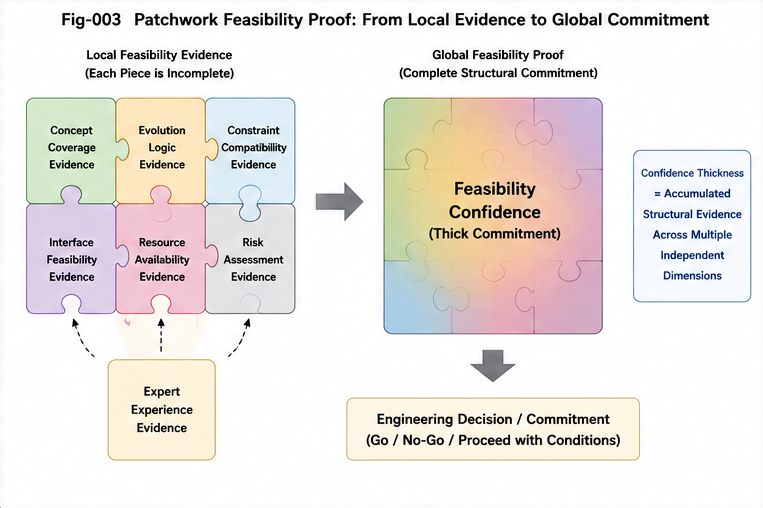

# SFC-003 — Patchwork Feasibility Proof

## How Feasibility Can Be Justified Without Exact End-to-End Precedent

# 1. Introduction

If Structural Feasibility Confidence (SFC) is the general framework for disciplined confidence under partial novelty, then **Patchwork Feasibility Proof (PFP)** is one of its most important mechanisms.

Patchwork Feasibility Proof addresses a common but under-formalized situation:

* the target has **not** been completed before in exactly the same end-to-end form,
* but the target is **not unsupported**,
* because multiple partial structures around it have already been validated.

Those structures may include:

* solved subtasks,
* reusable modules,
* neighboring trajectories,
* mechanism-level understanding,
* known repair strategies,
* and prior projects that cover most—but not all—of the target.

The central claim of PFP is simple:

> A target may be justified as feasible not by one complete precedent, but by a **patchwork of structurally relevant partial proofs**.

PFP is therefore not a replacement for direct execution evidence.
It is the framework for understanding how feasibility can still be argued when exact end-to-end precedent is absent.

---

#### Fig-003-Patchwork-Feasibility-Proof.png

---

# 2. Why a New Notion of “Proof” Is Needed

In many real-world settings, requiring a single complete precedent is too restrictive.

Suppose an engineer is asked to build a system she has never built before in exactly that form.
She may still have:

* already built the data layer,
* already built the authentication layer,
* already deployed systems with similar traffic and failure constraints,
* already integrated adjacent infrastructure components,
* and already debugged the failure modes likely to arise.

So although she cannot point to one exact prior system and say “this has already been done,” she can still make a serious, evidence-based argument that the new system is feasible.

The same holds for:

* a craftsman taking a custom commission,
* a scientist proposing a new experimental setup,
* a product team estimating a new product variant,
* a task planning system assembling a Task Calling Graph before every action path is implemented.

These are not cases of pure speculation.
But neither are they cases of exact precedent.

PFP exists to formalize this middle regime.

---

# 3. Definition of Patchwork Feasibility Proof

## **Patchwork Feasibility Proof (PFP)**

**Definition.**
Patchwork Feasibility Proof is a proof-like feasibility argument assembled from multiple partial but structurally relevant sources of evidence, rather than from one fully executed end-to-end precedent.

These evidence sources may include:

* completed subtasks,
* reusable components and operator clusters,
* neighboring trajectories in the same function family,
* mechanism-level understanding of the target domain,
* known fallback and recovery procedures,
* and bounded local gap-bridging strategies.

PFP does **not** claim that the target has already been fully realized.
Instead, it claims that the target lies inside a sufficiently supported extension region where feasibility can be justified by the composition of multiple local supports.

---

# 4. Why “Patchwork” Matters

The word **patchwork** is important.

It emphasizes that the proof is assembled from pieces that may differ in type, scale, and origin.
The evidence may not come from one source, one project, or one prior execution trace.

Instead, it may be distributed across a support landscape:

* one subtask was solved in Project A,
* another operator cluster was stabilized in Project B,
* the failure mode was already studied in Project C,
* a neighboring trajectory was executed last month,
* and the remaining gap is small enough to bridge by a known construction pattern.

No single piece is the proof.
The proof is the **composition**.

That is why PFP is especially useful for understanding intelligent extension behavior.
It captures the reality that many nontrivial commitments are justified by **assembled support**, not by one exact prior copy.

---

# 5. PFP Is Stronger Than Guessing, but Weaker Than Full End-to-End Confirmation

PFP should be placed carefully between two extremes.

## 5.1 It is stronger than intuition alone

PFP is not “I have a good feeling about it.”
It requires identifiable support structures:

* solved parts,
* reusable parts,
* adjacent precedents,
* mechanism understanding,
* and bridgeable gaps.

Without such support, the claim is not patchwork proof; it is speculation.

## 5.2 It is weaker than direct end-to-end confirmation

PFP is also not equivalent to a completed execution trace.
It does not eliminate risk, and it does not grant the same level of confidence as repeated direct success.

That is why PFP usually supports **extension feasibility confidence**, not pure confirmed confidence.

So PFP is best understood as a middle-grade proof form:

* stronger than unsupported optimism,
* weaker than exact full precedent,
* but often sufficient for disciplined commitment.

---

# 6. The Four Main Families of Patchwork Support

Patchwork Feasibility Proof can be decomposed into several recurring families of support.
The exact taxonomy may evolve, but the following four families are a useful starting point.

---

# 7. Family I — Subtask Coverage Proof

## **Subtask Coverage Proof**

The target may be new as a whole, but many of its component subtasks have already been completed.

Examples:

* A custom furniture piece may still rely on familiar cutting, joining, fitting, and finishing steps.
* A software system may require a new end-to-end assembly, while its storage, auth, and deployment subtasks are already well understood.
* A scientific workflow may combine known experimental procedures in a new configuration.

In this case, feasibility is supported because the unknown portion is smaller than the full target.
The target is not being created from zero; it is being assembled from partly known pieces.

---

# 8. Family II — Module Reuse Proof

## **Module Reuse Proof**

A target may be supported because the required building blocks already exist in reusable form.

Examples:

* A product variant can reuse the same chassis, manufacturing line, or firmware module.
* A software workflow can reuse a parser, a retrieval module, an orchestration layer, or a test harness.
* A craftsman can reuse jigs, patterns, templates, or known material workflows.

Module reuse matters because it reduces the amount of genuinely new construction required.
The system is not proving feasibility from scratch; it is proving that existing modules can be recombined into a viable target.

---

# 9. Family III — Adjacent Trajectory Proof

## **Adjacent Trajectory Proof**

A target may be supported because the system has already traversed neighboring trajectories in the same tunnel family.

Examples:

* A machinist has not made this exact part, but has repeatedly made parts with the same tolerance class and process constraints.
* A robotics system has not executed this exact route, but has navigated nearby environments with similar obstacle structure.
* A coding system has not implemented this exact service, but has implemented adjacent services in the same architectural family.

This is one of the most important sources of extension confidence.
It reflects the fact that many skills are not isolated points but **families of nearby traversable paths**.

---

# 10. Family IV — Mechanism Understanding Proof

## **Mechanism Understanding Proof**

A target may be supported because the system understands the causal or structural mechanism that governs success and failure, even if the exact target has not yet been executed.

Examples:

* A structural engineer understands load paths, failure modes, and stress concentrations.
* A database engineer understands indexing, contention, and consistency tradeoffs.
* A craftsperson understands how material behavior changes under finishing, humidity, or joinery choice.

Mechanism understanding does not remove all uncertainty.
But it often changes the character of the problem from “unknown unknown” to “known but unexecuted.”

That is a major upgrade in feasibility confidence.

---

# 11. PFP as Composition of Heterogeneous Support

The most important feature of PFP is that these support families can be composed.

A target may be justified by:

* 70% subtask coverage,
* 3 critical reusable modules,
* 2 adjacent trajectory precedents,
* and mechanism understanding that explains the remaining variation.

In other words, PFP is not a single evidence channel.
It is a **composition framework**.

That makes it well suited for real-world planning, where support is rarely cleanly packaged into one type of evidence.

---

# 12. PFP and the Structure of Missingness

PFP is especially useful because it changes how we think about what is missing.

Without a framework like PFP, novelty is often treated as an all-or-nothing state:

* either the target is already done,
* or it is simply “new.”

PFP replaces that with a more granular view.

A target may be new because:

* one subtask is missing,
* one interface is missing,
* one scaling constraint is untested,
* one material behavior is uncertain,
* or one integration step has never been attempted.

These are very different kinds of missingness.

PFP forces the evaluator to ask:

* Which parts are missing?
* Are they central or peripheral?
* Are they independent or coupled?
* Are they bridgeable by known means?
* What happens if the bridge fails?

This is why PFP is so closely tied to disciplined extension confidence.

---

# 13. PFP in Task Calling Graphs

Task Calling Graphs provide a particularly clean example.

A Task Calling Graph often describes a target organization of work that is not yet fully instantiated as executed action code.
If we insist that every edge in the Task Calling Graph must already have a complete Action Calling Graph behind it, then the task graph can only summarize the past; it cannot guide the future.

But real planning works differently.

A Task Calling Graph may be justified because:

* some task nodes already map to proven action clusters,
* some edges are supported by analogous prior workflows,
* some missing pieces are small enough to be bridged by standard implementation patterns,
* and the overall decomposition matches a known mechanism of task completion.

That is a textbook case of PFP.

The Task Calling Graph is not “fiction.”
It is a **feasibility scaffold** backed by a patchwork of local support.

---

# 14. PFP in Craftsmanship and Engineering

Craftsmanship gives an intuitive everyday picture of PFP.

A cabinetmaker accepts a commission for a piece never built before in exactly that form.
Why?

Not because the piece is already proven in its entirety, but because the cabinetmaker has a patchwork of support:

* known materials,
* known joints,
* known finishes,
* known dimensions of error tolerance,
* known workshop tools,
* known assembly sequences,
* and prior pieces structurally close to the new request.

Engineering estimation often works the same way.

An experienced engineer does not need an exact prior clone of a system to make a disciplined estimate.
She may rely on:

* reusable architecture,
* known integration patterns,
* prior load-bearing experience,
* known failure bottlenecks,
* and clear visibility into which parts are routine versus risky.

That is PFP in practice.

---

# 15. PFP Does Not Eliminate Risk — It Organizes It

One of the dangers in discussing proof-like feasibility is that readers may over-interpret it as certainty.

PFP does **not** eliminate risk.
What it does is make risk more legible.

It helps distinguish:

* what is already covered,
* what is only partially covered,
* what is weakly supported,
* and what remains speculative.

This matters because commitment decisions depend not only on expected success, but also on the shape of uncertainty.

For example, a target supported by strong PFP may still require:

* a higher quote,
* a prototype stage,
* a longer delivery window,
* a staged rollout,
* or an explicit “unknowns reserve.”

That is not a failure of the framework.
That is the framework working correctly.

PFP is not a magic pass to claim certainty.
It is a disciplined way to justify **bounded extension**.

---

# 16. PFP and Extension Feasibility Confidence

The relation between PFP and SFC can now be stated clearly.

* **SFC** is the broader feasibility-confidence framework.
* **Extension Feasibility Confidence** is the part of SFC concerned with targets that are not exact precedents.
* **PFP** is one of the main mechanisms by which extension feasibility confidence is justified.

So if SFC asks:

> “How can confidence be formed for an unseen but adjacent target?”

PFP answers:

> “By assembling multiple local supports into a structured feasibility argument.”

---

# 17. Limits of Patchwork Proof

PFP is powerful, but it has limits.

It weakens when:

* the missing pieces are too central,
* the missing pieces are tightly coupled in unknown ways,
* reusable modules do not actually compose cleanly,
* the target lies outside the known tunnel family,
* mechanism understanding is shallow,
* or failure is catastrophic and irrecoverable.

In those cases, the patchwork may no longer justify a strong commitment.
The target may move from extension territory toward speculation.

This is why later documents in the repository will discuss:

* confidence thickness,
* commitment boundaries,
* and the decay of support as targets move away from confirmed structures.

---

# 18. Conclusion

Patchwork Feasibility Proof captures a basic but pervasive fact of practical intelligence:

> many important commitments are justified not by one complete precedent, but by a structured composition of partial precedents.

That composition may include:

* solved subtasks,
* reusable modules,
* adjacent trajectories,
* and mechanism understanding.

PFP does not claim that the target is already done.
It claims that the target is **structurally supported enough** to justify disciplined extension.

This is one of the central mechanisms behind Structural Feasibility Confidence, and one of the main reasons intelligent systems can do more than simply repeat what has already been executed before.

---

# Key Takeaways

* **Patchwork Feasibility Proof (PFP)** is a proof-like feasibility argument built from **multiple partial supports**, not one exact end-to-end precedent.
* PFP is especially important when a target is **new but structurally adjacent** to validated work.
* Four major support families are:

  * **Subtask Coverage Proof**
  * **Module Reuse Proof**
  * **Adjacent Trajectory Proof**
  * **Mechanism Understanding Proof**
* PFP is stronger than vague intuition, but weaker than direct end-to-end confirmation.
* PFP is a major mechanism behind **Extension Feasibility Confidence** in the broader **SFC** framework.

## Addendum: LLM Scoring as Implicit Structural Feasibility Confidence

The scoring and ranking behavior of LLMs and Transformer-based models can be interpreted as a weak but important form of implicit Structural Feasibility Confidence.

A language model does not usually possess explicit proof that a continuation, plan, or answer is feasible in the same way an engineer may possess execution records or a craftsman may possess workshop experience. However, during generation and ranking, the model evaluates candidate continuations against a large statistical field of prior patterns, contextual compatibility, local coherence, semantic adjacency, and trajectory likelihood.

In that sense, LLM scoring resembles a statistical version of Patchwork Feasibility Proof. A candidate is not supported by one complete precedent. It is supported by many partial signals: token-level compatibility, phrase-level precedent, discourse-level continuity, task-format similarity, and latent structural adjacency to known examples.

This does not make LLM scoring equivalent to explicit SFC. It lacks clear boundary awareness, explicit gap typing, reliable causal understanding, and disciplined commitment governance. But it does show that modern generative models already contain a primitive form of feasibility ranking: they prefer continuations that appear structurally supported by the surrounding context and learned pattern field.

The SFC framework can therefore be seen as an attempt to make this implicit scoring logic more explicit, inspectable, controllable, and bridgeable.

## Addendum: LLM Scoring as Implicit Structural Feasibility Confidence

The scoring and ranking behavior of LLMs and Transformer-based models can be interpreted as a weak but important form of implicit Structural Feasibility Confidence.

A language model does not usually possess explicit proof that a continuation, plan, or answer is feasible in the same way an engineer may possess execution records or a craftsman may possess workshop experience. However, during generation and ranking, the model evaluates candidate continuations against a large statistical field of prior patterns, contextual compatibility, local coherence, semantic adjacency, and trajectory likelihood.

In that sense, LLM scoring resembles a statistical version of Patchwork Feasibility Proof. A candidate is not supported by one complete precedent. It is supported by many partial signals: token-level compatibility, phrase-level precedent, discourse-level continuity, task-format similarity, and latent structural adjacency to known examples.

This does not make LLM scoring equivalent to explicit SFC. It lacks clear boundary awareness, explicit gap typing, reliable causal understanding, and disciplined commitment governance. But it does show that modern generative models already contain a primitive form of feasibility ranking: they prefer continuations that appear structurally supported by the surrounding context and learned pattern field.

The SFC framework can therefore be seen as an attempt to make this implicit scoring logic more explicit, inspectable, controllable, and bridgeable.