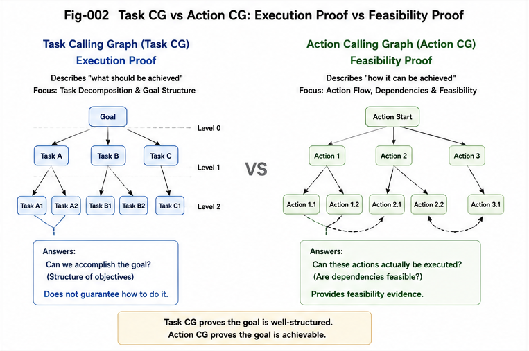

# SFC-005 — Task Calling Graph as Feasibility Scaffold

## Why Task Structure Can Legitimately Exist Before Full Action-Level Confirmation

# 1. Introduction

Task Calling Graphs create a special and highly revealing test case for Structural Feasibility Confidence (SFC).

At first glance, a Task Calling Graph may appear weaker than an Action Calling Graph.
An Action Calling Graph often corresponds to concrete action paths that have already been implemented, executed, or at least operationally grounded.
A Task Calling Graph, by contrast, frequently contains nodes and edges that are **not yet fully realized at the action level**.

This creates an apparent paradox:

> If a Task Calling Graph is not yet fully backed by executed Action Calling Graphs, what gives it legitimacy?

A narrow answer would be: “Nothing. It is only a wish list until fully implemented.”

This repository rejects that answer.

The central claim of this document is that a Task Calling Graph can be legitimate **before** complete action-level realization, provided it is supported by sufficient Structural Feasibility Confidence.

More specifically:

> A Task Calling Graph can function as a **feasibility scaffold**—a structured plan-space object supported by confirmed action subgraphs, reusable modules, adjacent project precedents, patchwork feasibility proof, and known bridge strategies.

This matters because if Task Calling Graphs were valid only after all underlying action paths were already complete, then they could summarize the past but could not guide the future.
That would destroy much of their value as planning structures.

---

#### ./figures/Fig-002-Task-Calling-Graph-vs-Action-Calling-Graph.png

---

# 2. Action Calling Graph vs Task Calling Graph

Before discussing scaffolding, it is useful to state the asymmetry clearly.

## 2.1 Action Calling Graph

An Action Calling Graph is generally closer to the level of concrete implementation and execution.
It is often supported by:

* actual code paths,
* runtime traces,
* concrete tool invocations,
* validated operator sequences,
* and observed state transitions.

Its legitimacy is therefore often grounded in **execution proof**.

## 2.2 Task Calling Graph

A Task Calling Graph sits at a different level.
It organizes work in terms of goals, subtasks, dependencies, transformations, and capability groupings.
Some of its edges may already be backed by implemented action patterns, but others may represent:

* not-yet-instantiated decompositions,
* planned bridges between known modules,
* anticipated but unimplemented workflows,
* or future orchestration structures.

Its legitimacy therefore cannot depend only on past execution.

Task Calling Graphs often need to exist **before** all details are complete.
Otherwise there would be no high-level structure for planning, gap localization, staged implementation, or extension.

This is why SFC becomes central.

---

# 3. The Core Claim

The main claim of this document is:

## **A Task Calling Graph is not merely a record of completed work. It can also be a feasibility scaffold.**

A feasibility scaffold is a structured representation that helps organize, justify, and guide future execution **before** full action-level confirmation is available.

It does so by leveraging support that already exists around the target task structure, such as:

* confirmed action clusters,
* reusable task modules,
* neighboring project precedents,
* known decomposition patterns,
* patchwork feasibility proof,
* and bridgeable local gaps.

This does **not** mean every imagined task graph is legitimate.
It means that a task graph may earn legitimacy from its support structure, not only from completed end-to-end realization.

---

# 4. Why Task Calling Graphs Need This Status

If Task Calling Graphs were forced to wait for full action completion before they could be considered valid, several important capabilities would be lost.

## 4.1 Planning Would Collapse into Retrospective Logging

The graph would no longer help propose new work.
It would only summarize what had already happened.

## 4.2 Gap Localization Would Become Much Harder

Without a task-level scaffold, it becomes difficult to identify where missing capabilities lie, how they relate, and which local bridges might close them.

## 4.3 Reuse and Transfer Would Be Under-Represented

Many tasks are feasible not because they already exist as full action paths, but because they can be assembled from known components.
A task graph needs to be able to represent that compositional possibility.

## 4.4 Multi-Stage Commitment Would Be Impossible to Express

A system often needs to say:

* “This task family is probably feasible, but these two nodes need probing first.”
* “This branch is supported; that branch is speculative.”
* “We can commit to the first half now and validate the rest later.”

Without a scaffold representation, such commitments become opaque and ad hoc.

So the issue is not philosophical.
It is operational.
A planning system needs a legitimate intermediate object between “already executed action graph” and “pure wishful thinking.”
Task Calling Graphs can occupy that role.

---

# 5. What Is a Feasibility Scaffold?

## **Feasibility Scaffold**

**Definition.**
A feasibility scaffold is a structured representation of a target task organization that is not yet fully realized at the action level, but is sufficiently supported by surrounding evidence that it can guide planning, decomposition, gap bridging, and staged commitment.

A feasibility scaffold differs from both:

* a **fully confirmed execution graph**, and
* a **speculative sketch with no structural support**.

It occupies the middle region where a target is partially new but structurally supported.

For a Task Calling Graph, this means the graph may contain a mixture of:

* already confirmed task-action mappings,
* partially supported nodes,
* inferred but bridgeable edges,
* and explicitly marked uncertainty boundaries.

This is exactly the sort of object SFC is designed to legitimize and regulate.

---

# 6. Sources of Support for a Task Calling Graph Scaffold

A Task Calling Graph does not need to float in free space.
Its support may come from multiple sources.

---

# 7. Confirmed Action Subgraphs

Some task nodes may already map cleanly to validated Action Calling Graphs.

Examples:

* a “parse input” task already backed by a known parser pipeline,
* a “retrieve document set” task already backed by a retrieval operator chain,
* a “run unit tests” task already backed by a stable test harness.

These confirmed action subgraphs anchor parts of the task graph in direct precedent.

---

# 8. Reusable Task Modules

A task graph may be supported by task modules that have already been used elsewhere.

Examples:

* “collect evidence → compare options → synthesize output”
* “ingest → normalize → transform → validate → publish”
* “draft → review → revise → finalize”

These modules need not prove the whole graph, but they reduce how much of the graph is genuinely new.

---

# 9. Adjacent Project Precedents

A task graph may be supported because neighboring projects have already exercised similar structures.

For example:

* a software workflow for generating one class of report may support a new report pipeline,
* a previous research DOI pipeline may support a new one with modified components,
* a prior AI coding workflow may support a new task orchestration graph with similar control structure.

This is especially important because many Task Calling Graphs are not invented from scratch; they are **adapted from nearby project families**.

---

# 10. Known Decomposition Patterns

Some tasks are not supported by identical prior graphs, but by well-understood decomposition logic.

Examples:

* document production tasks often decompose into overview → definitions → mechanism → examples → implications,
* software delivery tasks often decompose into architecture → implementation → test → packaging → release,
* research analysis tasks often decompose into question → distinction → mechanism → evidence → implications.

A task graph supported by a stable decomposition pattern is not arbitrary.
It is drawing strength from a known structural template.

---

# 11. Patchwork Feasibility Proof

Patchwork Feasibility Proof (PFP) is one of the most important sources of scaffold legitimacy.

A Task Calling Graph may be justified because:

* node A is already covered by confirmed actions,
* node B can reuse a module from a prior workflow,
* edge C→D matches a familiar orchestration pattern,
* node E is locally novel but bridgeable,
* and the overall structure matches a known project mechanism.

No single piece proves the whole graph.
But together they may justify treating the graph as a feasible scaffold rather than a speculative fantasy.

---

# 12. Bridgeable Local Gaps

A graph may remain legitimate even when some pieces are missing, provided those missing pieces are small, localized, and bridgeable.

Examples:

* one missing transformation operator,
* one missing evaluation step,
* one not-yet-written integration wrapper,
* one missing retry-and-fallback branch.

A Task Calling Graph need not be rejected simply because it contains gaps.
The critical question is whether those gaps lie inside a region of sufficient confidence thickness.

This is where SFC connects directly to gap bridging.

---

# 13. Task Calling Graphs as Structured Commitments

Once a Task Calling Graph is treated as a feasibility scaffold, it becomes possible to use it not only as a decomposition artifact but as a **commitment object**.

The system can now express judgments like:

* this subgraph is fully confirmed,
* that subgraph is extension-feasible,
* this node requires a probe before commitment,
* that branch is currently speculative,
* and this path can be accepted only with staged delivery.

This is a major upgrade over a flat task list or a purely rhetorical plan document.
The graph becomes a map of supported and unsupported work.

---

# 14. Why This Matters for Gap Bridging

Task Calling Graphs are one of the most natural homes for gap bridging because they make missing structure visible.

A missing action operator, a missing orchestration edge, or a missing dependency path becomes easier to identify when the task-level scaffold already exists.

More importantly, the scaffold helps answer a more subtle question:

> Is this missing piece isolated and bridgeable, or does it indicate that the whole graph is unsupported?

Without a scaffold, gap detection often becomes local and reactive.
With a scaffold, gap detection becomes contextual:

* which higher-level goal is the gap blocking?
* which neighboring nodes already exist?
* which alternate paths are available?
* how central is the missing piece to overall feasibility?

This is why Task Calling Graphs are not merely descriptive objects.
They are active instruments for controlled extension.

---

# 15. Why This Matters for AI Planning

AI planning systems will face this problem constantly.

If an AI agent is only allowed to represent tasks that already have complete action traces, then its planning horizon collapses to replay.
It cannot become a genuine planner.

If, on the other hand, it is allowed to create arbitrary unsupported task graphs, then planning becomes hallucination.

The correct middle path is to let the system construct Task Calling Graphs as feasibility scaffolds, but to regulate those scaffolds through SFC:

* Which nodes are confirmed?
* Which edges are supported only by patchwork proof?
* Where is confidence thickness strong?
* Where is a prototype required?
* Which branches should be deferred?

This is a natural design principle for future AI runtimes.

---

# 16. Task Calling Graphs and Ordinary Human Planning

Although this repository often uses software and AI examples, the same logic applies to ordinary human planning.

A person organizing a new workshop, a builder planning a renovation, or a researcher planning a new study often constructs a task graph before every action detail is known.

The plan remains useful because it is scaffolded by prior skill, known modules, and local feasibility judgments.

This is another reason the concept should not be reduced to software architecture.
Task-level scaffolding is a general cognitive phenomenon.

---

# 17. Limits of the Scaffold View

Calling a Task Calling Graph a feasibility scaffold does not mean every task graph deserves trust.

A scaffold can fail when:

* too many nodes lack real support,
* critical dependencies are unknown,
* the decomposition is superficial or misleading,
* bridge steps are underestimated,
* or the graph drifts too far from any known tunnel family.

So the scaffold view is not a permission slip for vague planning.
It is a framework for distinguishing between:

* **supported task structure**, and
* **unsupported graph-shaped optimism**.

That distinction is essential.

---

# 18. Conclusion

Task Calling Graphs matter because they allow intelligent systems to represent and organize work before every action path has been fully realized.

That role would be impossible if legitimacy required complete action-level confirmation in advance.

Structural Feasibility Confidence provides a better answer.

A Task Calling Graph can function as a **feasibility scaffold** when it is supported by:

* confirmed action subgraphs,
* reusable task modules,
* adjacent project precedents,
* known decomposition patterns,
* patchwork feasibility proof,
* and bridgeable local gaps.

In that role, the Task Calling Graph becomes more than a plan diagram.
It becomes a structured object for:

* extension,
* commitment,
* gap localization,
* staged implementation,
* and runtime governance.

This is one of the clearest places where SFC turns from abstract theory into concrete planning machinery.

---

# Key Takeaways

* A **Task Calling Graph** should not be reduced to a record of already executed work.
* It can function as a **feasibility scaffold** for partially new but structurally supported tasks.
* A scaffolded Task Calling Graph may draw legitimacy from:

  * confirmed action subgraphs,
  * reusable task modules,
  * adjacent project precedents,
  * known decomposition patterns,
  * patchwork feasibility proof,
  * and bridgeable local gaps.
* This view is crucial for:

  * planning,
  * gap localization,
  * staged commitment,
  * and future AI task orchestration.
* Without the scaffold view, Task Calling Graphs collapse either into **retrospective logging** or **unsupported speculation**.
