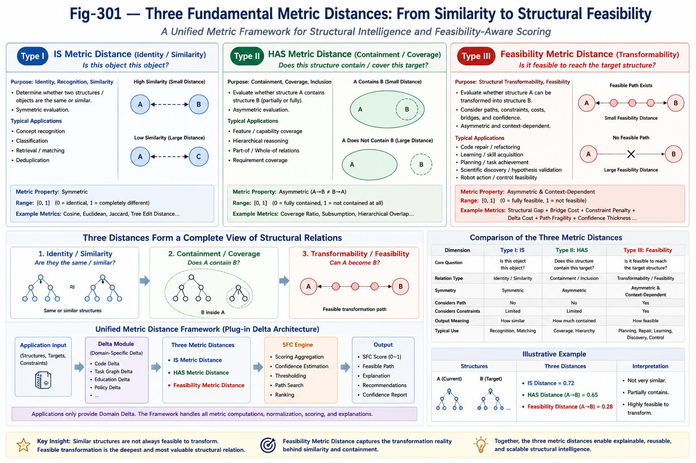

# SFC-010 — Feasibility Metric Distance: The Third Fundamental Metric Distance for Structural Intelligence

## From Similarity to Structural Feasibility

## Abstract

Similarity alone is often insufficient for intelligent systems.

Many engineering, scientific, educational, and AI problems are not fundamentally questions of similarity, but questions of structural feasibility.

Two structures may be highly similar yet impossible to transform into one another under given constraints. Conversely, two structures may appear quite different while remaining connected through a feasible sequence of structural transformations.

This paper proposes Feasibility Metric Distance (FMD) as the third fundamental metric distance within the Structural Feasibility Confidence (SFC) framework.

Together with IS Metric Distance and HAS Metric Distance, it forms a unified Metric Distance Framework capable of supporting reusable scoring, feasibility estimation, confidence computation, and explainable structural reasoning across diverse applications.

## 1. Motivation

Most existing similarity metrics answer questions such as

Is this object similar to another?

or

Does this object contain another?

However, real-world intelligent systems frequently ask a fundamentally different question:

Can the current structure evolve into the desired structure?

Examples include

Can this codebase be repaired?
Can this student learn this concept?
Can this robot complete this task?
Can this scientific hypothesis be verified?
Can an LLM successfully bridge this reasoning gap?

These are not similarity questions.

They are feasibility questions.

## 2. Three Fundamental Metric Distances

---
#### Fig-301-Three-Fundamental-Metric-Distances.png

---

The SFC framework proposes three complementary metric distances.

### Type I — IS Metric Distance

Question:

Is this object this object?

Purpose:

Identity, classification, recognition, matching.

Typical applications include

concept recognition
classification
retrieval
nearest-neighbor search

### Type II — HAS Metric Distance

Question:

Does this structure contain this target?

Purpose:

Containment and coverage.

Typical applications include

feature coverage
capability estimation
semantic inclusion
partial matching
hierarchical reasoning

HAS Metric Distance naturally supports asymmetric evaluation.

### Type III — Feasibility Metric Distance

Question:

Can the current structure reach the target structure?

Purpose:

Transformation feasibility.

Unlike similarity metrics, Feasibility Metric Distance estimates whether a valid structural path exists between two states.

This introduces the concept of

reachable structures
feasible bridges
transformation cost
confidence thickness
path robustness

which are central to Structural Intelligence.

## 3. One-Tree Triple-Test Framework

The original SFC scoring process evaluates every candidate using three complementary structural tests.

    Identity
    
    ↓
    
    Containment
    
    ↓
    
    Feasibility

Instead of treating these as application-specific heuristics, they can now be interpreted as three reusable metric distances.

IS Metric Distance

HAS Metric Distance

Feasibility Metric Distance

Consequently,

One-Tree Triple-Test

becomes

Three Unified Metric Distances.

This abstraction significantly improves reusability across applications.

## 4. Definition of Feasibility Metric Distance

Conceptually,

Feasibility Metric Distance measures

the structural effort required to transform one structure into another while preserving necessary constraints.

Unlike Euclidean or cosine distances,

its objective is not geometric similarity.

Its objective is

transformation feasibility.

A conceptual formulation may be written as

D
feasible
	​

=f(StructuralGap,BridgeComplexity,ConstraintViolation,DeltaCost,ConfidenceThickness,PathFragility)

where

Structural Gap

measures missing structures.

Bridge Complexity

measures intermediate transformations.

Constraint Violation

measures incompatibilities.

Delta Cost

measures required modifications.

Confidence Thickness

estimates confidence accumulated along feasible paths.

Path Fragility

measures robustness against perturbations.

The exact formulation depends on the application.

The framework remains reusable.

## 5. Unified Metric Distance Framework

A major advantage of introducing Feasibility Metric Distance is architectural unification.

Instead of implementing different scoring engines for every application,

all applications share the same metric framework.

    Application
    
    ↓
    
    Application Delta
    
    ↓
    
    Unified Metric Framework
    
    ↓
    
    Scoring
    
    ↓
    
    Confidence
    
    ↓
    
    Ranking
    
    ↓
    
    Explanation

The reusable framework performs

normalization
distance computation
confidence aggregation
threshold evaluation
feasible-path estimation
ranking
explanation generation

while individual applications only provide their own Delta modules.

## 6. Plug-in Delta Architecture

Different applications differ primarily in their Delta definitions.

Examples include

Code Repair Delta

Task Graph Delta

Education Delta

Scientific Discovery Delta

Calling Graph Delta

Policy Delta

Medical Diagnosis Delta

Robot Action Delta

Each application contributes only its domain-specific structural Delta.

The Metric Distance Framework performs all remaining computations.

This greatly reduces engineering complexity while improving consistency.

## 7. Relation to Structural Feasibility Confidence (SFC)

Within SFC,

Feasibility Metric Distance naturally supports confidence estimation.

A small feasibility distance generally indicates

low transformation cost
high structural compatibility
thick confidence tunnel
multiple feasible paths

Conversely,

large feasibility distance often implies

sparse bridges
fragile transformation
higher uncertainty

Thus,

Feasibility Metric Distance provides the quantitative foundation for Structural Feasibility Confidence.

## 8. Relation to Existing Structural Intelligence Components

Feasibility Metric Distance naturally integrates with previous Structural Intelligence components.

Calling Graph

provides executable structural pathways.

Differential Tree

provides structural organization and localization.

Function Tunnel

provides feasible transformation trajectories.

Gap Engine

identifies missing structures.

Metric Tree

supports efficient scoring and retrieval.

Structural Feasibility Confidence

integrates these components into a unified explainable scoring mechanism.

## 9. Engineering Significance

The introduction of Feasibility Metric Distance transforms SFC from an application-specific scoring strategy into a general-purpose metric infrastructure.

Instead of designing separate scoring algorithms for every intelligent application,

future systems may reuse a common Metric Distance Framework,

while only replacing domain-specific Delta modules.

This architecture promotes

modularity
explainability
consistency
scalability
transferability

across a broad spectrum of Structural Intelligence applications.

## 10. Conclusion

Traditional metric distances primarily measure similarity or containment.

Structural Intelligence introduces a third and fundamentally different question:

Can this structure realistically become that structure?

Feasibility Metric Distance provides a quantitative answer to this question.

Together,

IS Metric Distance,

HAS Metric Distance,

and Feasibility Metric Distance

form a unified family of reusable structural metrics that support explainable reasoning, confidence estimation, feasible transformation analysis, and scalable engineering reuse.

They constitute one of the foundational infrastructures for future Structural Intelligence systems.

## Key Takeaways
- **Feasibility Metric Distance (FMD)** extends metric reasoning beyond similarity and containment to **structural transformability**.
- Together with **IS Metric Distance** and **HAS Metric Distance**, it forms a **Three-Metric Framework** for Structural Intelligence.
- FMD enables reusable engines for **scoring, feasibility estimation, confidence computation, path search, ranking, and explanation**.
- Applications contribute only **domain-specific Delta modules**, while the unified metric framework handles the common computation.
- FMD provides the quantitative foundation for **Structural Feasibility Confidence (SFC)** and serves as a reusable infrastructure for future SI/ASI systems rather than a task-specific scoring heuristic.