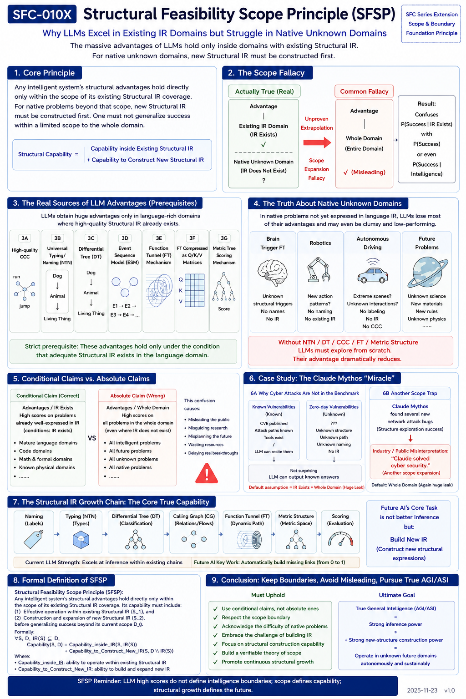

# SFC-010X — Structural Feasibility Scope Principle (SFSP)

## Why LLM Advantages Exist Only Inside Existing Structural IR

**Keywords:** Structural Feasibility, Scope Principle, Structural IR, LLM, Transformer, Function Tunnel, Differential Tree, Universal Typing, Metric Scoring, Native Problems, SI, ASI

---

# Abstract

Large Language Models (LLMs) have demonstrated extraordinary performance across a wide range of benchmarks. This success has led many observers to implicitly assume that the underlying capabilities naturally extend to intelligence over arbitrary future problems.

This paper argues that such an assumption is incorrect.

We propose the **Structural Feasibility Scope Principle (SFSP)**:

> **The structural advantages of an intelligent system hold directly only within the scope covered by its existing Structural IR. Outside that scope, new Structural IR must first be constructed before similar advantages can emerge.**

The distinction appears subtle but has profound implications.

Most current LLM capabilities are enabled not merely by Transformer architectures, but by operating inside language domains where structural representations—including naming systems, typing systems, concept hierarchies, calling patterns, and function tunnels—have already evolved over centuries.

Native unknown domains do not possess these structural assets.

Therefore, future AGI and ASI research must focus not only on inference within existing structures, but also on autonomous construction of new Structural IR.

---

# 1. Introduction

One of the most common misunderstandings surrounding modern AI is the silent transition from

> **Conditional capability**

to

> **Universal capability.**

The actual evidence demonstrates:

```
High Performance
|
Existing Structural IR
```

Yet this is frequently interpreted as

```
High Performance
|
Entire Problem Space
```

No theoretical proof supports this extrapolation.

SFSP formalizes this missing boundary.

---

#### Fig-210X-Structural-Feasibility-Scope-Principle-SFSP.png



---

# 2. Structural Capability Has a Scope

We define Structural IR as the complete structural representation available to an intelligent system, including:

* Naming
* Typing
* Differential Trees
* Calling Graphs
* Event representations
* Function Tunnels
* Metric structures
* Evaluation mechanisms

Within such an established structural space, efficient reasoning becomes possible.

Outside it, reasoning must first construct the representation itself.

Therefore,

```
Structural Capability

=

Capability Inside Existing Structural IR

+

Capability to Construct New Structural IR
```

These are fundamentally different abilities.

---

# 3. Why LLMs Perform So Well

LLMs inherit enormous structural advantages because natural language already provides an exceptionally mature Structural IR.

Among the most important structural components are:

## 3.1 High-quality Common Concept Cores (CCC)

Language contains highly stable conceptual anchors shared across generations.

These naturally provide robust semantic alignment.

---

## 3.2 Universal Naming and Typing

Words are already standardized.

Concepts already possess mature labels.

Objects are already categorized.

No construction is required.

---

## 3.3 Differential Trees

Language naturally forms hierarchical concept trees.

Example:

```
Dog

↓

Animal

↓

Living Thing
```

The hierarchy already exists before Transformer learning begins.

---

## 3.4 Event Sequence Models

Human language is fundamentally event-oriented.

Transformer learns from enormous event sequences that already encode rich structural regularities.

---

## 3.5 Function Tunnels

Language implicitly contains millions of stabilized Function Tunnels.

Transformer compresses these recurring structural trajectories into efficient parameter representations.

---

## 3.6 Metric Scoring

Transformer attention mechanisms continuously evaluate structural compatibility.

This naturally resembles metric-space scoring over structural feasibility.

---

# 4. These Advantages Have Preconditions

The previous section does **not** imply that these advantages hold universally.

They depend on one strict condition:

> **Adequate Structural IR already exists.**

Without existing Structural IR,

none of the previous advantages automatically exist.

This distinction is the essence of SFSP.

---

# 5. Existing IR Domains vs Native Domains

Examples of Existing IR domains include:

* Natural language
* Source code
* Mathematics
* Classical scientific knowledge
* Existing engineering documentation

These domains possess:

* Mature naming
* Mature typing
* Mature concept hierarchies
* Existing Function Tunnels
* Established evaluation mechanisms

Therefore LLMs perform exceptionally well.

---

Native domains are fundamentally different.

Examples include:

* Unknown brain trigger mechanisms
* Future robotics
* Autonomous driving edge cases
* Novel scientific discoveries
* Unknown materials
* Unknown biological systems
* Future civilizations

These problems often lack:

* Stable names
* Shared concepts
* Differential Trees
* Existing Function Tunnels
* Structural evaluation metrics

Consequently,

LLMs lose much of their structural advantage.

---

# 6. The Scope Fallacy

The most common reasoning error can be summarized as

```
High Performance

↓

Existing IR

↓

Entire Domain
```

This silent expansion is not justified.

It is a classic scope error.

We define it as the

> **Structural Scope Fallacy**

The mistake is not believing LLMs are powerful.

The mistake is extending that power beyond its demonstrated structural scope.

---

# 7. The Claude Mythos Example

Recent demonstrations in cybersecurity illustrate this issue.

Suppose Claude discovers several previously unknown vulnerabilities.

This demonstrates that

```
LLM

↓

Successfully Explored

↓

Several New Structures
```

It does **not** demonstrate

```
LLM

↓

Solved Cybersecurity
```

These are entirely different claims.

The first concerns successful structural exploration.

The second concerns an entire problem domain.

Confusing the two repeats exactly the same Scope Fallacy.

---

# 8. The Future of AGI

Most future AGI problems belong to native domains.

They are characterized by

* unknown concepts
* unknown structures
* unknown metrics
* unknown Function Tunnels
* unknown naming systems

Therefore future AI cannot rely solely on inference.

Its primary challenge becomes

> **Constructing new Structural IR.**

This represents a qualitative transition from

```
Reasoning
```

toward

```
Structural Construction.
```

---

# 9. Structural IR Growth

Future intelligent systems must continuously construct

```
Naming

↓

Typing

↓

Differential Trees

↓

Calling Graphs

↓

Function Tunnels

↓

Metric Structures

↓

Scoring Mechanisms
```

Only after these structures emerge can inference reach the efficiency observed in mature language domains.

Thus,

future intelligence is fundamentally a process of structural growth.

---

# 10. Formal Statement of SFSP

**Structural Feasibility Scope Principle (SFSP)**

> The structural advantages of any intelligent system hold directly only within the scope covered by its existing Structural IR.

For native problems outside that scope, equivalent capability requires constructing new Structural IR before existing structural advantages can emerge.

Formally,

```
∀S,D

If

IR(S) ⊆ D

then

Capability(S,D)

=

Capability_inside_IR

+

Capability_to_Construct_New_IR
```

where

Capability_inside_IR represents efficient reasoning within existing structures,

and

Capability_to_Construct_New_IR represents structural expansion beyond the current boundary.

---

# 11. Implications for SI and ASI

SFSP suggests that future SI and ASI research should shift emphasis from merely improving inference engines toward developing mechanisms capable of autonomous structural growth.

Key research directions include:

* Automatic naming systems
* Universal typing systems
* Dynamic Differential Tree construction
* Autonomous Calling Graph evolution
* Function Tunnel discovery
* Structural metric generation
* Self-expanding Structural IR

These capabilities define the transition from solving existing problems to creating entirely new solution spaces.

---

# 12. Why World Models Naturally Emerge

One of the most interesting implications of SFSP is that it offers a unified interpretation of several major research directions that have emerged after the first generation of LLMs.

Researchers from different communities have increasingly argued that language alone is insufficient for achieving robust general intelligence.

Instead, many recent efforts have shifted toward richer world representations, embodied interaction, and environment modeling.

From the perspective of SFSP, this trend is not accidental.

It reflects a common structural challenge:

> **Existing language IR covers only part of the world.**

When intelligence moves beyond mature language domains into native physical environments, many of the structural assets that make LLMs successful begin to disappear.

These missing assets include:

- Stable naming systems
- Mature typing hierarchies
- Differential Trees
- Function Tunnels
- Structural metrics
- Long-term environmental dynamics

Consequently, future AI systems must construct new Structural IR rather than merely performing inference inside existing language IR.

In this sense, many current research directions can be interpreted as attempts to expand the structural coverage of AI.

|Research Direction	|Structural Interpretation under SFSP |
|---|---|
|World Models	|Build Structural IR for physical environments
|Embodied AI	|Construct IR through interaction with the real world
|Robotics	|Learn new Function Tunnels absent from language
|Autonomous Driving	|Build Structural IR for dynamic physical events
|Scientific Discovery	|Generate new concepts, metrics, and Structural IR
|Brain-inspired AI	|Construct internal structural representations beyond language

> **Although these communities employ different terminology, SFSP suggests that they may all be confronting the same underlying limitation: the boundary of existing Structural IR.**

---

# Conclusion

Structural Feasibility is not unlimited.

It possesses a scope.

LLMs achieve remarkable success because they operate within one of humanity's richest existing Structural IRs: natural language.

This success should not be generalized beyond its demonstrated structural boundary.

The future of AGI will depend not merely on stronger inference, but on the autonomous construction of entirely new Structural IRs.

The **Structural Feasibility Scope Principle (SFSP)** provides a theoretical boundary that distinguishes demonstrated capability from unsupported extrapolation, while simultaneously identifying the central challenge for future Structural Intelligence systems:

**Not merely reasoning inside existing structures, but continuously creating new ones.**

> **SFSP does not argue that all future AI research should converge on one architecture. Rather, it suggests that many seemingly different research directions may share the same underlying objective: expanding the boundary of Structural IR.**
