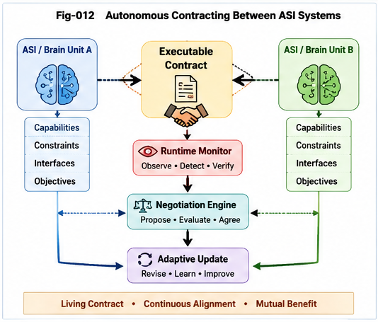

# SFC-011

# Autonomous Contracting

## From Human Contracts to AI-Generated Structural Agreements

---

## Abstract

Human contracts have long been regarded as legal documents governing cooperation among individuals and organizations.

This article proposes a different perspective.

A contract is fundamentally a structural agreement describing how multiple independent systems can cooperate while preserving capability boundaries, interface compatibility, responsibilities, and constraints.

As AI systems evolve toward autonomous agents and Brain Units, contract generation itself becomes an engineering problem rather than merely a legal one.

Structural Feasibility Confidence (SFC) provides one possible computational foundation for future Autonomous Contracting.

---

# 1. Why Contracts Exist

Contracts reduce uncertainty before cooperation begins.

They explicitly define:

* responsibilities;
* interfaces;
* capabilities;
* obligations;
* acceptable constraints.

In essence, contracts transform uncertain cooperation into predictable structural collaboration.

---

# 2. Human Contracts as Structural Descriptions

Although contracts are written in natural language, most clauses actually describe structural relationships.

Examples include:

* required inputs;
* expected outputs;
* interface specifications;
* timing;
* quality constraints;
* liability boundaries.

Viewed structurally, contracts become descriptions of feasible cooperation rather than collections of legal sentences.

---

# 3. Why AI Systems Will Need Contracts

Future AI systems will increasingly cooperate.

Examples include:

* multiple Brain Units;
* autonomous robots;
* specialized engineering agents;
* scientific research agents;
* industrial automation systems.

Each possesses different capabilities and limitations.

Before collaboration begins, each system must verify whether cooperation is structurally feasible.

This verification naturally requires Structural Feasibility Confidence.

---

#### Fig-012-Autonomous-Contracting-Between-ASI-Systems.png

---

# 4. Executable Contracts

Traditional contracts remain static after signing.

Future AI contracts may instead become executable runtime objects.

A structural agreement can be continuously monitored during execution.

Violations become detectable immediately.

Capability changes can trigger automatic renegotiation.

The contract therefore evolves from documentation into runtime policy.

---

# 5. Adaptive Contracts

Unlike human contracts, AI contracts need not remain fixed.

Capability improvements,

resource changes,

new participants,

or changing objectives

can automatically trigger structural reevaluation.

The contract itself becomes adaptive.

---

# 6. Autonomous Contracting

Ultimately, negotiation, feasibility evaluation, contract generation, execution monitoring, and revision may all become autonomous computational processes.

From this perspective,

contracts become machine-readable structural feasibility proofs.

Structural Feasibility Confidence provides one possible computational mechanism for generating such agreements.

---

# Conclusion

Human contracts describe cooperation.

Future AI contracts may actively construct cooperation.

Autonomous Contracting therefore represents a natural engineering extension of Structural Feasibility Confidence and an important step toward collaborative ASI systems.
