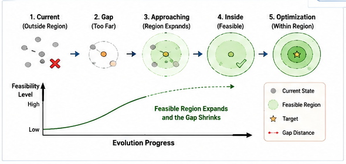

# SFC-012

# From Gap Bridging to Structural Feasible Regions

---

## Abstract

Gap Bridging has traditionally been viewed as the process of progressively reducing structural gaps.

This article proposes a broader interpretation.

Rather than viewing evolution as movement across isolated gaps, structural evolution can be understood as progressive entry into an expanding Structural Feasible Region.

This perspective naturally introduces geometric intuition into feasibility reasoning and provides a more general interpretation of Gap Bridging.

---

#### .Fig-013-From-Gap-Bridging-to-Feasible-Region.png

---

# 1. The Classical Gap View

Traditional Gap Bridging describes evolution as:

Current State

↓

Gap

↓

Target

Although useful, this representation does not explain how feasibility gradually emerges during evolution.

---

# 2. Structural Feasible Regions

Every engineering problem possesses a region in which feasible solutions exist.

Outside this region,

successful evolution is impossible.

Inside this region,

optimization becomes possible.

Structural evolution therefore consists of entering and expanding feasible regions rather than simply eliminating isolated gaps.

---

# 3. Feasibility Distance

Similarity alone cannot determine whether evolution is possible.

Instead,

each structural modification changes the distance to the feasible region.

Structural Feasibility Confidence estimates this evolving feasibility distance.

Gap Bridging therefore becomes continuous movement toward higher feasibility.

---

# 4. Progressive Structural Evolution

Concept coverage improves.

Evolution logic becomes increasingly consistent.

Immutable constraints become satisfied.

Each successful improvement expands feasible structural space.

Eventually,

the current structure enters the feasible region.

Subsequent evolution becomes parameter optimization rather than structural reconstruction.

---

# 5. Engineering Implications

This interpretation explains why experienced engineers often recognize feasible solutions before complete designs exist.

They evaluate whether the current trajectory has already entered the feasible region.

The remaining work becomes implementation rather than discovery.

---

# 6. Relation to Structural Feasibility Metric

Structural Feasibility Metric supplies the quantitative evaluation mechanism.

Gap Bridging supplies the evolutionary process.

Structural Feasible Regions provide the geometric interpretation.

Together they form a unified framework for structural reasoning.

---

# Conclusion

Gap Bridging should not be viewed merely as gap elimination.

It is better understood as progressive entry into increasingly feasible structural regions.

This interpretation provides a natural geometric foundation for Structural Feasibility Confidence.
