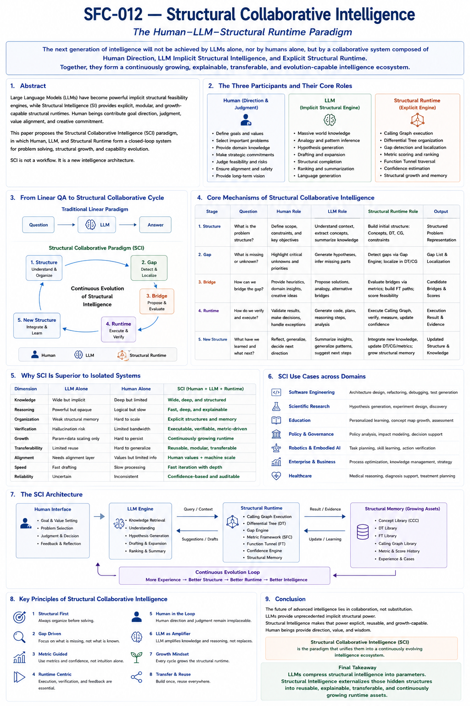

# SFC-012 — Structural Collaborative Intelligence
## The Human–LLM–Structural Runtime Paradigm

## Abstract

Artificial Intelligence is entering a new stage.

The central question is no longer whether Large Language Models (LLMs) are powerful enough to solve increasingly complex problems.

Instead, the more fundamental question becomes:

> **How should humans, LLMs, and explicit structural systems collaborate to produce continuously growing intelligence?**

This paper proposes Structural Collaborative Intelligence (SCI), a new collaborative paradigm in which Human intelligence, implicit structural intelligence embedded inside LLMs, and explicit Structural Runtime cooperate as three complementary participants rather than competing alternatives.

Instead of following the traditional

> Question → Answer

interaction model,

SCI introduces an iterative structural cycle:

> **Structure → Gap → Bridge → Runtime → New Structure**

Through repeated iterations, structural assets—including Calling Graphs, Differential Trees, Function Tunnels, Metric Frameworks, Gap Engines, and Structural Feasibility Confidence—are continuously accumulated, refined, and transferred across applications.

SCI therefore represents not merely a new workflow, but a new architecture for continuously evolving intelligence.

---

#### Fig-SFC-012-Structural-Collaborative-Intelligence.png

---

## 1. From Prompt Engineering to Structural Collaboration

The first generation of LLM applications focused primarily on prompts.

The interaction model was simple:

    Question
    
    ↓
    
    Prompt
    
    ↓
    
    LLM
    
    ↓
    
    Answer

Although highly successful,

this model remains fundamentally stateless.

Every new problem begins almost from scratch.

Knowledge may accumulate inside documents,

repositories,

or conversations,

but the structural runtime itself grows only weakly.

As engineering problems become larger,

scientific reasoning becomes deeper,

and collaborative projects become longer,

prompt-centric workflows begin to reveal their limitations.

Future intelligence requires something more persistent.

It requires

**shared structural assets.**

---

## 2. Three Complementary Participants

SCI proposes that future intelligence naturally consists of three complementary participants.

### Human

Humans contribute

- long-term goals,
- value alignment,
- creativity,
- judgment,
- strategic direction,
- problem selection,
- feasibility intuition,
- scientific curiosity.

Humans remain responsible for deciding

what should be explored,

why it matters,

and when discoveries become meaningful.

### Large Language Models

LLMs contribute

- massive implicit structural knowledge,
- pattern recognition,
- analogy generation,
- structural expansion,
- language generation,
- ranking,
- drafting,
- latent feasibility estimation.

As argued in SFC-010,

LLMs behave as

> **implicit structural feasibility engines.**

They provide extraordinary structural coverage,

although much of it remains compressed inside parameter space.

### Structural Runtime

Structural Runtime contributes

- Calling Graph execution,
- Differential Tree organization,
- Universal Naming,
- Gap localization,
- Metric Frameworks,
- Structural Feasibility Confidence,
- explainable reasoning,
- reusable structural memory,
- continuous structural growth.

Unlike parameterized models,

Structural Runtime remains

explicit,

inspectable,

modifiable,

and transferable.

---

Together,

these three participants form an integrated intelligence ecosystem.

None replaces the others.

Each amplifies the strengths of the others.

---

## 3. From Question–Answer to Structure–Gap–Structure

Traditional AI interaction follows a linear process.

    Question
    
    ↓
    
    Answer

SCI replaces this with an iterative structural cycle.

    Structure
    
    ↓
    
    Gap
    
    ↓
    
    Bridge
    
    ↓
    
    Runtime
    
    ↓
    
    New Structure
    
    ↓
    
    New Gap
    
    ↓
    
    Continuous Evolution

Every completed problem leaves behind reusable structural assets.

Future problems therefore become easier rather than merely different.

The runtime itself evolves.

Consequently,

knowledge accumulation gradually shifts

from document accumulation

to

**runtime accumulation.**

---

## 4. Runtime Becomes the Primary Growing Asset

One of the most important observations from long-term Human–LLM collaboration is that productivity often increases over time.

This phenomenon cannot be explained solely by better prompting.

Instead,

it reflects the gradual maturation of the structural runtime.

As projects continue,

participants increasingly share

- common naming conventions,
- stable Calling Graphs,
- Differential Trees,
- Metric Frameworks,
- structural confidence models,
- reusable Gap patterns,
- Function Tunnel libraries.

New problems are therefore processed inside an increasingly organized structural environment.

Rather than repeatedly rebuilding context,

SCI continuously extends its runtime.

The runtime,

not the prompt,

becomes the principal growing asset.

---

## 5. Human–LLM–Structural Runtime Co-Evolution

The three participants continuously improve one another.

Human researchers refine structural understanding.

Structural Runtime organizes this understanding into reusable assets.

LLMs amplify these assets through implicit structural expansion and analogy generation.

Improved structural assets then enable humans to discover more advanced problems,

which further improve the runtime.

The resulting evolution cycle becomes

    Human
    
    ↓
    
    Structure
    
    ↓
    
    LLM Expansion
    
    ↓
    
    Runtime Update
    
    ↓
    
    New Discovery
    
    ↓
    
    Better Structure

rather than

    Human
    
    ↓
    
    Prompt
    
    ↓
    
    Answer

This distinction is fundamental.

SCI is not an interaction protocol.

It is an evolving intelligence architecture.

---

## 6. Structural Assets Instead of Conversation History

Traditional AI systems frequently rely on conversation history.

SCI instead emphasizes structural assets.

Examples include

- Concept Core libraries,
- Calling Graph repositories,
- Differential Tree hierarchies,
- Function Tunnel collections,
- Metric Frameworks,
- Gap databases,
- Structural Confidence records.

These assets possess several important properties.

They are

- explainable,
- reusable,
- versionable,
- measurable,
- transferable,
- continuously improvable.

Most importantly,

they remain largely independent of any particular LLM implementation.

---

## 7. Why Structural Collaboration Is More Scalable

As AI systems become increasingly capable,

the primary engineering challenge shifts.

The bottleneck is no longer generating answers.

The bottleneck becomes

organizing intelligence.

Prompt engineering scales poorly because prompts remain largely independent.

Structural Runtime scales naturally because structures accumulate.

Each newly constructed Calling Graph,

Differential Tree,

Metric,

or Function Tunnel

immediately becomes available to future problems.

Growth therefore becomes cumulative.

SCI transforms intelligence development

from repeated problem solving

into

continuous structural infrastructure construction.

---

## 8. Beyond Human–AI Cooperation

SCI also provides a framework for future multi-agent systems.

Because Structural Runtime is explicit,

multiple execution engines may share the same structural assets.

Examples include

- different LLMs,
- Brain Units,
- robots,
- autonomous vehicles,
- digital twins,
- scientific simulators.

The execution engine may change.

The structural runtime remains.

Consequently,

SCI naturally supports

cross-model,

cross-application,

and cross-embodiment collaboration.

---

## 9. Strategic Implications

SCI suggests a significant shift in future AI engineering.

The central objective is no longer building the largest isolated model.

Instead,

future intelligence systems should increasingly invest in

- reusable structural runtimes,
- transferable structural assets,
- explainable metric frameworks,
- collective structural memory,
- collaborative runtime evolution.

The most valuable long-term asset therefore becomes

not merely parameter scale,

but

**Structural Runtime Capital.**

---

## 10. Conclusion

Large Language Models have transformed artificial intelligence by compressing enormous amounts of structural knowledge into parameter space.

Structural Intelligence complements this achievement by externalizing those hidden structures into explicit runtime assets that remain explainable, reusable, transferable, and continuously extensible.

Human intelligence contributes direction, judgment, values, and scientific curiosity.

Together,

these three components form

**Structural Collaborative Intelligence (SCI).**

SCI represents a transition

from isolated intelligence

to collaborative intelligence,

from static reasoning

to evolving runtime,

and from repeated prompting

to continuously growing structural infrastructure.

It is therefore not simply another AI workflow,

but a candidate paradigm for the next generation of human-centered intelligent systems.

---

## Key Takeaways
- Future AI is likely to be collaborative rather than model-centric.
- Humans, LLMs, and Structural Runtime contribute complementary capabilities.
- The fundamental workflow shifts from **Question → Answer to Structure → Gap → Bridge → Runtime → New Structure**.
- Structural Runtime—not prompts—becomes the primary accumulating engineering asset.
- Structural assets such as Calling Graphs, Differential Trees, Function Tunnels, and Metric Frameworks enable explainability, reuse, transferability, and continuous growth.
- SCI naturally supports collaboration across models, applications, and embodiments.
- Rather than replacing humans or LLMs, Structural Runtime organizes and amplifies both into a continuously evolving intelligence ecosystem.

---

## Relation to Fig-302

**Figure SFC-012** ("Structural Collaborative Intelligence: The Human–LLM–Structural Runtime Paradigm") provides the visual architecture corresponding to this paper. It illustrates the three-participant collaboration model, the transition from linear Question–Answer workflows to iterative structural evolution, the complementary roles of Human, LLM, and Structural Runtime, and the accumulation of reusable structural assets that enable explainable, transferable, and continuously growing intelligence.