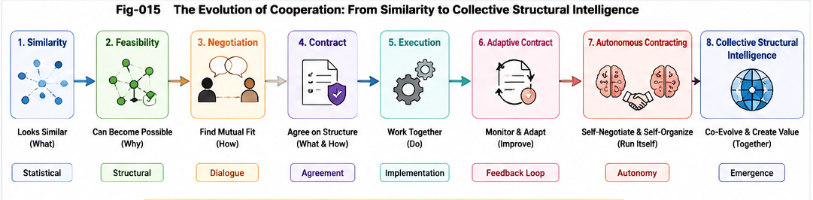

# SFC-013

# Structural Feasibility Metrics Beyond Similarity

---

## Abstract

Most modern AI systems are built upon similarity-based representations.

Embedding models, vector databases, and retrieval systems all estimate relationships primarily through similarity.

This article argues that many engineering and scientific reasoning problems are fundamentally feasibility problems rather than similarity problems.

Structural Feasibility Metrics (SFM) therefore represent a complementary direction for future AI reasoning.

---

#### Fig-014-Evolution-of-Human-Cooperation.png

---

#### Fig-015-Evolution-of-Human-Cooperation-From-Similarity-to-Structure-Intelligence.png

---

# 1. The Success of Similarity

Similarity metrics have transformed information retrieval,

representation learning,

recommendation,

semantic search,

and large language models.

Their success demonstrates the importance of measuring structural resemblance.

However,

similarity answers only one class of questions.

---

# 2. Similarity Is Not Feasibility

Two structures may appear highly similar while remaining impossible to transform into one another.

Conversely,

apparently different structures may possess straightforward transformation paths.

Engineering decisions therefore require evaluating feasibility rather than appearance alone.

---

# 3. Structural Feasibility Metrics

Structural Feasibility Metrics evaluate whether structural evolution can occur while preserving required concepts,

valid evolution logic,

and immutable constraints.

Instead of ranking resemblance,

they estimate transformability.

This distinction changes the objective from comparison to constructive evolution.

---

# 4. Engineering Applications

Structural Feasibility Metrics naturally support:

* engineering design;
* software evolution;
* manufacturing planning;
* puzzle reasoning;
* Function Tunnel analysis;
* Gap Bridging;
* autonomous planning;
* AI collaboration.

These applications extend beyond conventional similarity-based retrieval.

---

# 5. Structural Feasibility Confidence

Structural Feasibility Confidence represents one practical realization of Structural Feasibility Metrics.

Confidence is interpreted as accumulated structural evidence supporting feasible evolution.

Confidence therefore becomes an observable consequence of a broader feasibility evaluation framework.

---

# 6. Looking Beyond SFC

Future research may further investigate:

* Feasibility Distance;
* Structural Evidence Aggregation;
* Feasibility Geometry;
* Autonomous Contracting;
* Computable Cooperation.

Together these directions suggest the emergence of a broader Structural Feasibility Metrics framework.

---

# Conclusion

Similarity explains how structures resemble one another.

Structural Feasibility Metrics explain how structures can evolve into one another.

Structural Feasibility Confidence provides an engineering realization of this broader perspective and establishes the foundation for future research into computable structural cooperation.
