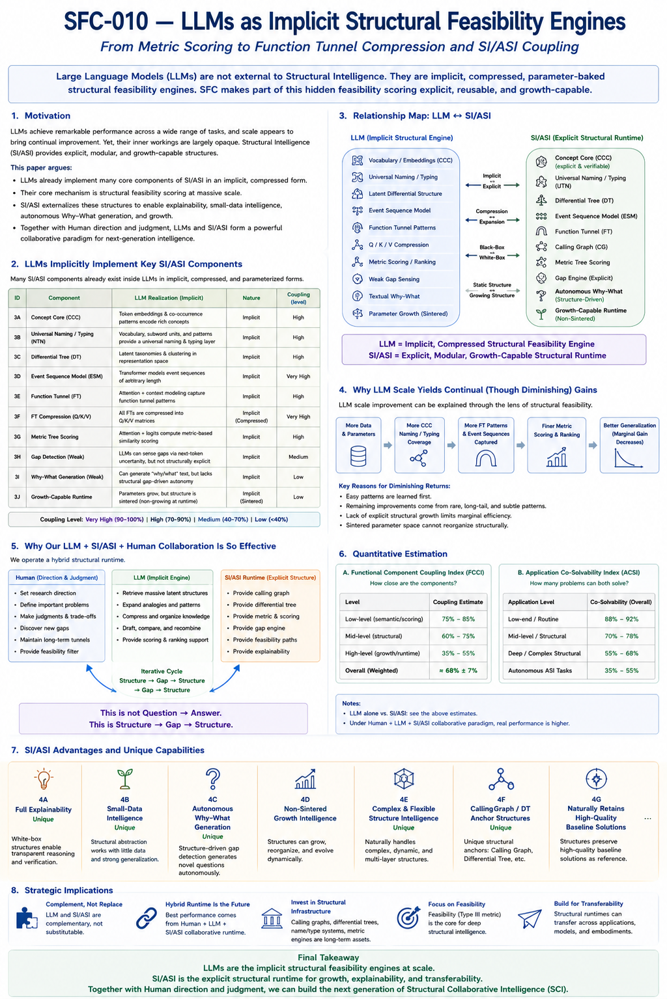
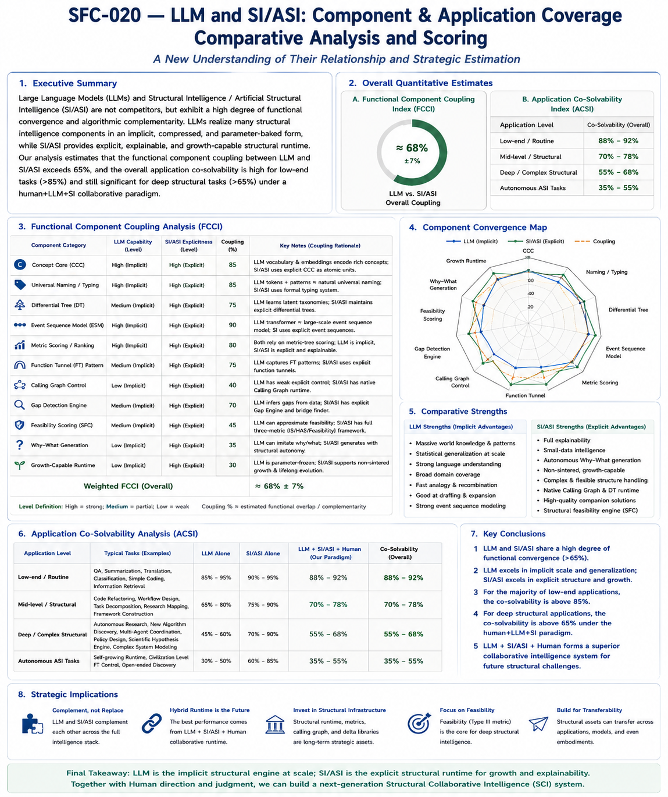

# SFC-210 — LLMs as Implicit Structural Feasibility Engines
## From Metric Scoring to Function Tunnel Compression and SI/ASI Coupling

## Abstract

Large Language Models (LLMs) have demonstrated remarkable performance across language understanding, programming, scientific reasoning, and numerous engineering tasks. Their continuing improvement through scaling has motivated extensive discussions regarding the nature of intelligence, reasoning, and future AI architectures.

This paper argues that many of the core capabilities exhibited by modern LLMs can be better understood from the perspective of **Structural Intelligence (SI)** rather than purely statistical learning. Instead of viewing LLMs merely as probabilistic next-token predictors, we propose interpreting them as **implicit structural feasibility engines** that perform large-scale structural scoring, ranking, and feasibility estimation within a highly compressed parameter space.

From this perspective, LLMs already realize many fundamental SI components—including Concept Cores (CCC), Universal Naming and Typing, latent Differential Trees, Event Sequence Models, Function Tunnel representations, and metric-based structural scoring—but implement them implicitly through distributed representations rather than explicit structural runtimes.

We further argue that Structural Intelligence does not compete with LLMs. Instead, SI externalizes, modularizes, explains, and extends many of the structural mechanisms that already exist implicitly inside LLMs. This interpretation provides a coherent explanation for both the extraordinary success of LLM scaling and its gradually diminishing returns, while suggesting a collaborative future centered on Human–LLM–Structural Runtime co-evolution.

---

## From Engineering Feasibility to LLM Interpretation

Structural Feasibility was not originally proposed as a theory for interpreting Large Language Models.

Instead, it emerged from a series of investigations into engineering reasoning, gap bridging, task organization, function tunnels, runtime intelligence, and structural feasibility itself.

Only after these structural concepts had gradually matured did an unexpected observation appear.

Many practical behaviors exhibited by modern LLMs—including engineering completion, scoring, ranking, patchwork reasoning, iterative refinement, and partial solution construction—appeared increasingly compatible with structural feasibility concepts that had originally been developed for entirely different engineering purposes.

Consequently, the present work should not be viewed as beginning with LLMs and extending Structural Feasibility toward them.

Rather, it represents the opposite direction.

Structural Feasibility first emerged as an independent engineering framework.

Its relevance to LLMs became apparent only through later structural convergence.

This historical development provides the motivation for the engineering interpretation presented throughout this article.

---

#### Fig-210--LLMs-as-Implicit-Structural-Feasibility-Engines.png

---

## 1. Motivation

The rapid success of Large Language Models has fundamentally changed modern artificial intelligence.

Across diverse domains—including software engineering, mathematics, scientific writing, education, and general knowledge—LLMs routinely demonstrate capabilities that were once believed to require explicit symbolic reasoning or carefully engineered knowledge bases.

Yet despite these impressive achievements, an important question remains largely unanswered:

> **What kind of intelligence is actually emerging inside large language models?**

Most existing explanations emphasize

- statistical learning,
- representation learning,
- attention mechanisms,
- next-token prediction,
- scaling laws,
- or emergent behaviors.

These perspectives successfully explain many engineering characteristics of LLMs.

However, they explain less clearly why LLMs repeatedly exhibit behaviors resembling

- conceptual organization,
- structural analogy,
- engineering feasibility estimation,
- hierarchical abstraction,
- problem decomposition,
- solution ranking,
- and latent reasoning.

These observations suggest that something more fundamental may be occurring beneath the surface.

This paper explores that possibility.

Rather than treating Structural Intelligence and LLMs as competing paradigms, we investigate their structural convergence.

Our central thesis is straightforward:

> **Modern LLMs already implement many essential components of Structural Intelligence—but in an implicit, compressed, and parameterized form.**

Consequently,

Structural Intelligence should not be viewed as an alternative to LLMs.

Instead,

it provides an explicit engineering interpretation of many hidden mechanisms already operating inside them.

---

## 2. Why LLMs Should Be Viewed Structurally

Traditional descriptions often characterize LLMs as statistical language models.

While technically correct, this description is increasingly incomplete.

Consider a programming task.

A capable LLM frequently performs the following sequence:

    Understand requirements
    
    ↓
    
    Infer missing context
    
    ↓
    
    Locate related concepts
    
    ↓
    
    Estimate feasible modifications
    
    ↓
    
    Compare alternatives
    
    ↓
    
    Generate implementation
    
    ↓
    
    Evaluate consistency

None of these operations directly resemble simple next-token prediction.

Instead, they resemble successive stages of **structural feasibility evaluation**.

Similarly,

during scientific discussion,

LLMs often

- compare conceptual frameworks,
- infer latent relationships,
- estimate plausible hypotheses,
- reject inconsistent reasoning,
- and rank alternative explanations.

These behaviors indicate repeated structural evaluation rather than mere lexical prediction.

From the Structural Intelligence perspective,

the fundamental computational question is not

> "Which token comes next?"

but rather

> "Which structural continuation remains most feasible?"

Token prediction becomes only the visible output of a much deeper structural scoring process.

---

## 3. LLMs as Implicit Structural Feasibility Engines

We therefore propose the following interpretation.

> **Definition**

> A Large Language Model functions as an implicit structural feasibility engine that estimates, scores, and ranks possible structural continuations within an extremely compressed parameter space.

Several characteristics distinguish this interpretation.

First,

LLMs rarely enumerate all possible reasoning paths explicitly.

Instead,

billions of previously learned structural regularities have already been compressed into network parameters.

Inference therefore consists largely of recovering highly feasible structural continuations rather than constructing them from scratch.

Second,

LLMs naturally reject many infeasible continuations.

Even without explicit logical constraints,

they frequently avoid

- contradictory code,
- inconsistent narratives,
- impossible API usages,
- structurally invalid arguments,
- implausible engineering designs.

This behavior resembles feasibility filtering rather than simple memorization.

Third,

LLMs consistently rank multiple candidate continuations according to their estimated feasibility.

Beam search,

sampling,

and internal probability distributions

all serve as approximations to structural ranking mechanisms.

Consequently,

many apparent language-generation behaviors may instead be viewed as manifestations of latent structural feasibility estimation.

---

## 4. Implicit SI Components Already Inside LLMs

If the previous interpretation is accepted,

many classical Structural Intelligence components appear naturally inside modern LLMs.

The difference lies primarily in implementation.

Structural Intelligence makes these mechanisms explicit.

LLMs compress them into distributed representations.

The following subsections discuss several major examples.

### 4.1 Concept Core (CCC)

Structural Intelligence introduces the Concept Core (CCC) as a stable structural anchor shared across multiple observations.

Within LLMs,

an explicit CCC does not exist as an independent symbolic object.

Nevertheless,

token embeddings,

co-occurrence statistics,

and repeated contextual learning collectively approximate stable concept centers.

For example,

the concept

> "compiler"

accumulates associations involving

- parsing,
- syntax,
- optimization,
- intermediate representation,
- code generation,
- error diagnostics,

across billions of training examples.

Although no explicit CCC node exists,

its functional role clearly emerges.

Thus,

LLMs implicitly realize Concept Cores through distributed semantic convergence.

Structural Intelligence externalizes these concept cores,

making them individually identifiable,

traceable,

and reusable.

### 4.2 Universal Naming and Typing

Naming constitutes one of the most underestimated components of intelligence.

A consistent naming system dramatically reduces reasoning complexity.

Modern LLMs demonstrate remarkable ability to

- infer suitable terminology,
- normalize expressions,
- map synonyms,
- identify categories,
- generate meaningful identifiers.

These capabilities strongly resemble Universal Naming and Typing mechanisms.

However,

inside LLMs,

naming remains largely implicit.

No explicit global typing system governs reasoning.

Structural Intelligence proposes making this layer explicit through reusable Universal Naming and Typing infrastructures.

Doing so enables

- explainability,
- interoperability,
- reusable structural assets,
- long-term consistency,
- collective knowledge growth.

### 4.3 Differential Tree

Differential Trees organize concepts through progressively refined distinctions.

Modern LLMs exhibit surprisingly similar behaviors.

Embeddings naturally cluster related concepts.

Nearby representations often correspond to semantic hierarchies.

Fine-grained distinctions gradually emerge during training.

Nevertheless,

these structures remain latent.

They are difficult to inspect,

modify,

or extend explicitly.

Structural Intelligence instead introduces explicit Differential Trees whose

- branches,
- attributes,
- constraints,
- inheritance,
- localization,

remain fully observable.

The latent semantic organization inside LLMs therefore appears closely related to Differential Tree concepts,

although implemented through entirely different computational mechanisms.

### 4.4 Event Sequence Models

Transformer architectures excel at modeling sequential dependencies.

This capability extends far beyond natural language.

Programming,

mathematics,

scientific reasoning,

and procedural planning

all involve event sequences.

Structural Intelligence explicitly models such sequences using Event Sequence Models (ESMs),

where events,

states,

operations,

and transitions remain individually accessible.

LLMs,

by contrast,

encode these sequential regularities implicitly through attention patterns and parameter interactions.

Although explicit event structures disappear,

their behavioral effects remain remarkably strong.

This suggests that Event Sequence Modeling constitutes one of the most mature implicit structural capabilities already present inside current LLMs.

### 4.5 Function Tunnel Representation

One of the central ideas developed throughout the Structural Intelligence framework is the notion of a **Function Tunnel (FT)**—a constrained structural trajectory that preserves feasibility while guiding evolution toward a target objective.

Although LLMs contain no explicit representation labeled as a Function Tunnel, many of their strongest behaviors are consistent with tunnel-like computation.

When generating code, mathematical derivations, engineering analyses, or scientific explanations, the model rarely explores arbitrary continuations. Instead, it tends to remain within statistically reinforced pathways that preserve semantic coherence, syntactic validity, and functional consistency.

From this viewpoint, attention mechanisms do not merely connect tokens. They collectively approximate feasible structural trajectories accumulated across enormous numbers of examples.

The major difference lies in representation.

Structural Intelligence models Function Tunnels explicitly as reusable, explainable structural assets.

LLMs compress these trajectories into distributed parameter space.

As a consequence, the tunnels become extremely efficient to execute but difficult to inspect, modify, extend, or intentionally evolve.

This observation motivates one of the central hypotheses of this work:

> **Transformer inference can be interpreted as large-scale implicit Function Tunnel traversal performed within a compressed structural manifold.**

### 4.6 Metric Scoring as the Hidden Computational Core

Perhaps the strongest convergence between LLMs and Structural Intelligence appears in scoring.

Regardless of application,

every LLM inference step ultimately requires ranking candidate continuations.

Whether implemented through logits,

attention interactions,

beam search,

sampling,

or reinforcement-based preference optimization,

the computational objective remains remarkably similar:

> **Estimate which continuation is structurally more feasible than competing alternatives.**

Structural Intelligence proposes making this process explicit through reusable metric frameworks such as

- IS Metric Distance,
- HAS Metric Distance,
- and Feasibility Metric Distance.

Instead of relying exclusively on hidden parameter interactions,

explicit Structural Intelligence introduces observable scoring dimensions,

including

- structural compatibility,
- bridge complexity,
- transformation feasibility,
- confidence accumulation,
- constraint preservation,
- and path robustness.

Viewed from this perspective,

modern LLMs already perform massive-scale metric scoring.

Structural Intelligence does not replace this capability.

Rather,

it externalizes the scoring process,

making it explainable,

modular,

reusable,

and continuously extensible.

---

## 5. Why Scaling Continues to Work

One of the most remarkable observations of modern AI is that increasing model scale consistently improves performance across a surprisingly wide range of tasks.

This phenomenon is often described empirically through scaling laws.

However, from the Structural Intelligence perspective, scaling can be interpreted more structurally.

Instead of simply saying

> larger models memorize more,

we propose a different interpretation.

Larger models gradually accumulate increasingly rich implicit structural assets.

These include

- Concept Cores,
- Universal Naming patterns,
- latent Differential Trees,
- Event Sequence Models,
- Function Tunnel fragments,
- structural scoring experiences,
- and feasibility estimation examples.

Consequently,

larger models possess increasingly dense structural neighborhoods.

When inference begins,

the model can retrieve,

combine,

and rank a larger number of candidate structural continuations.

Therefore,

scaling continuously improves

- structural coverage,
- ranking quality,
- feasibility estimation,
- analogy generation,
- engineering robustness,
- and knowledge integration.

From this perspective,

parameter growth is not merely increasing storage capacity.

It is increasing the density of implicit structural feasibility knowledge.

---

## 6. Why Scaling Eventually Shows Diminishing Returns

Although scaling remains effective,

its gains gradually diminish.

This observation naturally follows from the previous interpretation.

Initially,

additional parameters capture

high-frequency concepts,

major event sequences,

common engineering patterns,

and broadly reusable function tunnels.

These provide enormous performance improvements.

Later,

new parameters primarily capture

rare exceptions,

long-tail structures,

domain-specific variations,

and subtle contextual refinements.

The marginal structural benefit therefore decreases.

More importantly,

implicit parameter representations eventually face a second limitation.

Structural organization itself becomes increasingly difficult to improve without explicit structural assets.

For example,

compressed parameters cannot easily

reorganize concept hierarchies,

modify Function Tunnel topology,

explicitly insert new Differential Tree branches,

or maintain reusable Calling Graphs.

These operations require structural editing rather than statistical accumulation.

Consequently,

future improvements may increasingly depend upon introducing explicit structural runtimes rather than relying exclusively on parameter scaling.

This interpretation suggests that Structural Intelligence is not a replacement for scaling,

but a complementary direction for overcoming its structural limitations.

---

## 7. Why Human + LLM + Structural Intelligence Works So Well

The previous sections explain why LLMs possess powerful implicit structural capabilities.

However,

our experience also suggests another important observation.

The strongest performance frequently emerges not from LLMs alone,

but from collaboration among

Human,

LLM,

and an explicit Structural Runtime.

These three participants naturally contribute different capabilities.

The Human primarily provides

- long-term objectives,
- problem selection,
- research direction,
- value judgment,
- structural commitment,
- and discovery priorities.

The LLM contributes

- massive implicit structural knowledge,
- analogical reasoning,
- structural expansion,
- language generation,
- ranking,
- drafting,
- and latent feasibility estimation.

Structural Intelligence contributes

- explicit Calling Graphs,
- Differential Trees,
- Universal Naming,
- Gap localization,
- Feasibility Metrics,
- Confidence estimation,
- structural explanations,
- and growth-capable runtime organization.

Together,

they produce a collaborative workflow fundamentally different from traditional prompting.

Rather than

    Question
    
    ↓
    
    Answer
    
the process becomes
    
    Structure
    
    ↓
    
    Gap
    
    ↓
    
    Bridge
    
    ↓
    
    Runtime
    
    ↓
    
    New Structure
    
    ↓
    
    New Gap
    
    ↓
    
    Continuous Evolution

This iterative structural cycle gradually accumulates reusable structural assets.

The runtime itself continuously improves.

Consequently,

future problems become easier to organize,

localize,

and solve.

The improvement therefore arises not merely from better prompts,

but from a progressively richer structural runtime.

---

#### Fig-211-LLM-and-SIandASI-Component-and-Application-Coverage-Comparative-Analysis.png

---

## 8. Functional Coupling Between LLM and Structural Intelligence

The previous discussions naturally raise an important quantitative question.

How similar are LLMs and Structural Intelligence?

Although no exact mathematical answer currently exists,

component-level analysis provides useful engineering estimates.

Several major SI components already appear implicitly inside modern LLMs.

| **Structural Component**	| **Estimated Functional Coupling** |
|---|---|
|Concept Core (CCC)	85–90%
|Universal Naming / Typing	|80–90%
|Differential Tree	|70–80%
|Event Sequence Model	|90–95%
|Metric Scoring	|80–90%
|Function Tunnel	|70–80%
|Gap Estimation	|60–70%
|Feasibility Scoring	|50–65%
|Calling Graph Runtime	|35–50%
|Autonomous Why Generation	|30–45%
|Growth-Capable Structural Runtime	|25–40%

Using weighted estimation,

the overall Functional Component Coupling Index (FCCI) is approximately

> **68% ± 7%.**

This estimate suggests that modern LLMs already implement a substantial portion of Structural Intelligence,

although primarily in implicit and compressed forms.

---

## 9. Application Co-Solvability

Functional similarity alone does not determine practical usefulness.

An equally important question is

> How many real-world problems can both paradigms solve?

Application-level analysis provides another useful estimate.

Routine semantic tasks,

including

- translation,
- summarization,
- programming assistance,
- classification,
- information retrieval,

show very high overlap.

Estimated common solvability exceeds

**88–92%.**

Medium-complexity engineering tasks,

including

- software architecture,
- workflow design,
- research organization,
- system decomposition,

remain highly overlapping,

with estimated co-solvability around

**70–78%.**

Deep structural problems,

including

- autonomous research,
- scientific discovery,
- complex policy reasoning,
- structural evolution,

show noticeably lower overlap,

approximately

**55–68%.**

These tasks increasingly benefit from explicit structural runtimes,

Gap Engines,

Calling Graphs,

and explainable feasibility reasoning.

Finally,

fully autonomous Structural Intelligence remains largely outside current LLM capabilities.

Consequently,

the **Application Co-Solvability Index (ACSI)** depends upon application complexity.

Overall weighted estimates suggest

> **72–82%**

common application coverage.

This indicates that LLMs and Structural Intelligence should be regarded primarily as complementary systems rather than competing paradigms.

---

## 10. Strategic Implications

The interpretation proposed in this paper carries several important implications.

First,

LLMs should no longer be viewed purely as language models.

They increasingly resemble large-scale implicit structural engines.

Second,

Structural Intelligence should not be interpreted as replacing LLMs.

Instead,

it externalizes and extends many structural mechanisms already hidden inside them.

Third,

future AI systems may benefit more from improving structural runtime organization than from indefinitely increasing parameter counts.

Explicit

- Calling Graphs,
- Differential Trees,
- Metric Frameworks,
- Function Tunnels,
- Gap Engines,
- and Structural Runtime Engineering

provide engineering capabilities difficult to obtain through parameter scaling alone.

Finally,

the future of advanced AI may lie in collaborative systems rather than isolated models.

Human judgment,

LLM implicit intelligence,

and explicit Structural Runtime organization together provide a more balanced path toward explainable,

growth-capable,

transferable,

and continuously evolving intelligence.

---

## 11. Conclusion

Large Language Models have demonstrated extraordinary practical success.

However,

their remarkable performance becomes considerably more understandable when viewed through the lens of Structural Intelligence.

Rather than treating LLMs as purely probabilistic language generators,

this paper argues that they function more fundamentally as **implicit structural feasibility engines**.

Many foundational SI components—

including Concept Cores,

Universal Naming,

Differential organization,

Event Sequence Modeling,

Function Tunnel representations,

and metric-based structural scoring—

already appear implicitly inside modern LLMs.

Structural Intelligence makes these mechanisms explicit,

modular,

interpretable,

and continuously extensible.

Consequently,

the relationship between LLMs and Structural Intelligence is not opposition,

but convergence.

One emphasizes

compression.

The other emphasizes

structure.

One excels at large-scale implicit generalization.

The other excels at explicit organization,

growth,

explainability,

and transferability.

Together,

they suggest a new engineering paradigm in which intelligence is progressively accumulated through reusable structural runtimes rather than parameter growth alone.

---

## Key Takeaways
- **LLMs can be interpreted as implicit structural feasibility engines rather than merely next-token predictors.**
- Many core SI components already exist inside LLMs in compressed, parameterized forms.
- Continued scaling improves performance by increasing implicit structural coverage and feasibility estimation.
- Diminishing returns arise because compressed parameters cannot easily reorganize explicit structural assets.
- Estimated **Functional Component Coupling (FCCI)** between LLMs and SI is approximately **68% ± 7%**.
- Estimated **Application Co-Solvability (ACSI)** ranges from 88–92% for routine tasks to **55–68%** for deep structural problems.
- Human, LLM, and Structural Intelligence form complementary roles within a shared structural runtime.
- The future frontier is likely **Structural Runtime Engineering**, where explicit structural assets augment rather than replace foundation models.

---

## Relation to the SFC Series

This paper establishes the theoretical bridge between Large Language Models and the Structural Feasibility Confidence framework.

It complements:

- **SFC-001–009**, which introduce Structural Feasibility Confidence and Function Tunnel Confidence.
- **SFC-010 (Feasibility Metric Distance)**, which formalizes structural feasibility as the third fundamental metric distance.
- **Future SFC papers on Structural Collaborative Intelligence (SCI)**, which investigate Human–LLM–Structural Runtime co-evolution.

Rather than positioning Structural Intelligence as an alternative to LLMs, this work argues 
that **SFC provides an explicit, explainable, reusable, and growth-capable structural layer that externalizes many of the feasibility mechanisms already operating implicitly inside modern foundation models**.