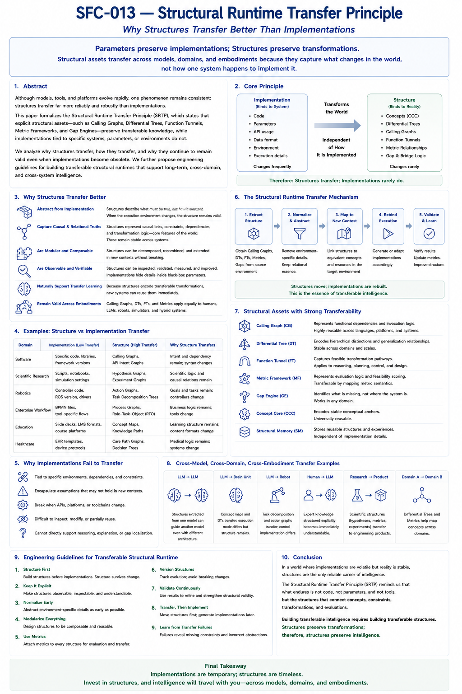

# SFC-213 — Structural Runtime Transfer Principle
## Why Structures Transfer Better Than Implementations

## Abstract

Modern Artificial Intelligence has achieved remarkable capabilities through increasingly powerful foundation models and software systems. Nevertheless, implementations evolve rapidly. Programming languages change, APIs become obsolete, models are replaced, hardware evolves, and embodiments diversify.

Amid these continual changes, one observation remains remarkably stable:

> **Structures transfer far more reliably than implementations.**

This paper proposes the Structural Runtime Transfer Principle (SRTP), which argues that explicit structural assets—including Calling Graphs, Differential Trees, Function Tunnels, Metric Frameworks, Gap Engines, and Structural Feasibility Confidence—represent transformations rather than implementations. Consequently, they naturally survive changes in programming languages, models, applications, execution engines, and physical embodiments.

Rather than treating implementations as the primary carrier of intelligence, SRTP identifies Structural Runtime as the long-term transferable infrastructure of intelligent systems. This perspective provides a theoretical foundation for reusable, explainable, cross-domain, and continuously evolving Structural Intelligence.

---

## 1. Introduction

Software changes.

Hardware changes.

Foundation models change.

Robots change.

Programming languages change.

Entire technological ecosystems change.

Yet despite these continual transformations, certain knowledge repeatedly survives.

For example,

a sorting algorithm may be rewritten in different programming languages.

A medical diagnosis process may be implemented by different hospitals.

A planning strategy may be executed by different robots.

The implementation changes.

The underlying structure remains.

This observation motivates an important question:

> **What is the true carrier of transferable intelligence?**

Traditional engineering often assumes that implementations are the primary assets.

Structural Intelligence proposes a different answer.

The enduring carrier is

structure.

---

#### Fig-213-Structural-Runtime-Transfer-Principle.png

---

## 2. Parameters Preserve Implementations; Structures Preserve Transformations

One of the central principles emerging from Structural Intelligence may be summarized succinctly.

> **Parameters preserve implementations. Structures preserve transformations.**

Parameters encode

how one particular system performs a task.

Structures encode

how transformations should occur regardless of implementation.

For example,

a neural network parameter set preserves

statistical execution behavior.

A Calling Graph preserves

functional dependency.

A Differential Tree preserves

conceptual organization.

A Function Tunnel preserves

feasible transformation trajectories.

A Metric Framework preserves

evaluation logic.

These structural assets remain meaningful even after execution engines change.

Consequently,

implementations are generally

engine-specific,

while structures are

engine-independent.

---

## 3. Why Structures Transfer Better

Several fundamental properties explain this phenomenon.

### 3.1 Structures Represent Invariants

Implementations describe

how something is currently executed.

Structures describe

what relationships remain true.

For example,

concept hierarchies,

dependency graphs,

causal relationships,

planning sequences,

and transformation pathways

remain largely stable despite implementation changes.

Structures therefore encode

invariants,

not temporary realizations.

### 3.2 Structures Separate Logic from Execution

Structural Runtime naturally separates

logical organization

from

execution mechanisms.

Consequently,

the same Calling Graph may execute through

- an LLM,
- a Brain Unit,
- a symbolic planner,
- a robot,
- or a human team.

Only the execution layer changes.

The structural organization remains identical.

### 3.3 Structures Are Explainable

Unlike parameter distributions,

explicit structures remain

observable,

inspectable,

editable,

and verifiable.

Developers may directly inspect

Calling Graphs,

Differential Trees,

Gap locations,

Metric calculations,

and Function Tunnel trajectories.

Explainability therefore becomes an intrinsic property rather than an afterthought.

### 3.4 Structures Naturally Support Reuse

Reusable software components have long been a central engineering objective.

Structural Runtime extends this idea beyond software modules.

Instead of reusing code,

future systems increasingly reuse

structures.

Examples include

- reusable task graphs,
- reusable Differential Trees,
- reusable Metric Frameworks,
- reusable Gap patterns,
- reusable Function Tunnel libraries.

Knowledge therefore becomes progressively cumulative.

---

## 4. Multi-Level Transferability

Structural Runtime naturally supports several different forms of transfer.

### 4.1 Cross-Application Transfer

Many structural assets remain applicable across domains.

For example,

Gap localization,

Metric Scoring,

Calling Graph reasoning,

and Feasibility estimation

apply equally to

software engineering,

education,

robotics,

scientific research,

healthcare,

and enterprise systems.

Applications differ primarily in their domain-specific Delta modules.

The structural runtime remains largely unchanged.

### 4.2 Cross-Model Transfer

Foundation models continue to evolve rapidly.

Different LLMs possess different architectures,

training corpora,

and capabilities.

However,

explicit structural assets remain reusable.

A Differential Tree,

Calling Graph,

or Metric Framework

may guide

GPT,

future LLMs,

Brain Units,

or hybrid reasoning engines

without major modification.

### 4.3 Cross-Embodiment Transfer

Perhaps the most significant advantage emerges when transferring across physical embodiments.

Consider

Human,

Robot,

Autonomous Vehicle,

Digital Twin,

Scientific Simulator.

Their sensors,

actuators,

and execution mechanisms differ substantially.

Yet

planning structures,

Function Tunnels,

Gap reasoning,

Metric evaluation,

and confidence estimation

remain remarkably similar.

Only perception and execution adapters require modification.

The structural runtime itself survives.

---

## 5. Structural Runtime Engineering

These observations suggest a new engineering discipline.

Rather than centering development around isolated implementations,

future systems may increasingly invest in

Structural Runtime Engineering.

Its primary objectives include

- constructing reusable Calling Graphs,
- organizing Differential Trees,
- maintaining Universal Naming,
- building transferable Function Tunnel libraries,
- developing reusable Metric Frameworks,
- preserving structural memory,
- continuously improving structural confidence.

Unlike conventional runtime systems,

Structural Runtime is designed not only for execution,

but also for

growth,

reuse,

explanation,

and transfer.

---

## 6. Structural Runtime as Long-Term Infrastructure

The long-term value of Structural Runtime lies in its cumulative nature.

Every completed project contributes new structural assets.

Every validated Function Tunnel improves future planning.

Every Differential Tree expands future organization.

Every Metric refinement improves future scoring.

Unlike isolated software systems,

Structural Runtime accumulates

collective structural experience.

It therefore resembles

scientific infrastructure

rather than software products.

---

## 7. Strategic Implications

The Structural Runtime Transfer Principle changes how future AI systems should be developed.

Rather than maximizing implementation complexity,

engineering effort should increasingly maximize

transferable structural assets.

Future investments may therefore prioritize

- reusable structures,
- explainable organization,
- transferable runtime libraries,
- structural metrics,
- collaborative structural memory.

The resulting systems become

less dependent on any individual model,

programming language,

or hardware platform.

Instead,

their primary asset becomes

persistent structural knowledge.

---

## 8. Relation to Structural Collaborative Intelligence

Structural Collaborative Intelligence (SCI),

introduced in SFC-212,

depends fundamentally upon Structural Runtime Transfer.

Human participants,

LLMs,

and future execution engines

must all share

the same transferable structural assets.

Without transferability,

runtime growth becomes fragmented.

With transferability,

every structural improvement immediately benefits future collaborations,

regardless of implementation.

SRTP therefore provides one of the foundational principles underlying SCI.

---

## 9. Conclusion

Technological implementations inevitably evolve.

Programming languages,

foundation models,

robotic platforms,

and execution engines will continue to change.

Yet the structural relationships that govern reasoning,

planning,

transformation,

evaluation,

and collaboration

remain comparatively stable.

Structural Runtime Transfer Principle therefore proposes a simple but powerful conclusion:

> **Implementations are temporary. Structures are enduring.**

Future intelligent systems should therefore invest not merely in better implementations,

but in better transferable structures.

Because structures preserve transformations rather than implementations,

they naturally support

reuse,

explainability,

continuous growth,

cross-model collaboration,

cross-domain migration,

and cross-embodiment intelligence.

Structural Runtime thus becomes not only an execution environment,

but a long-term carrier of accumulated intelligence.

---

## Key Takeaways
- **Structures transfer more reliably than implementations because they encode invariant transformations rather than execution details.**
- **Parameters preserve implementations; structures preserve transformations.**
- Structural Runtime supports transfer across **applications, models, execution engines, and physical embodiments**.
- Calling Graphs, Differential Trees, Function Tunnels, Metric Frameworks, and Gap Engines constitute transferable structural assets.
- Structural Runtime Engineering emphasizes **execution, explanation, growth, reuse, and transfer** rather than execution alone.
- Long-term AI progress depends increasingly on accumulating reusable structural assets instead of repeatedly rebuilding implementations.
- **Structural Runtime Transfer Principle (SRTP)** provides one of the theoretical foundations for **Structural Collaborative Intelligence (SCI)**.

---

## Relation to Fig-303

**Figure SFC-013** ("Structural Runtime Transfer Principle: Why Structures Transfer Better Than Implementations") serves as the visual companion to this paper. It contrasts implementation-dependent assets with structure-preserving assets, illustrates the mechanisms of cross-application, cross-model, and cross-embodiment transfer, and summarizes the engineering guidelines for building transferable Structural Runtime systems. Together, the figure and this paper establish SRTP as a foundational principle for reusable, explainable, and continuously evolving Structural Intelligence infrastructure.