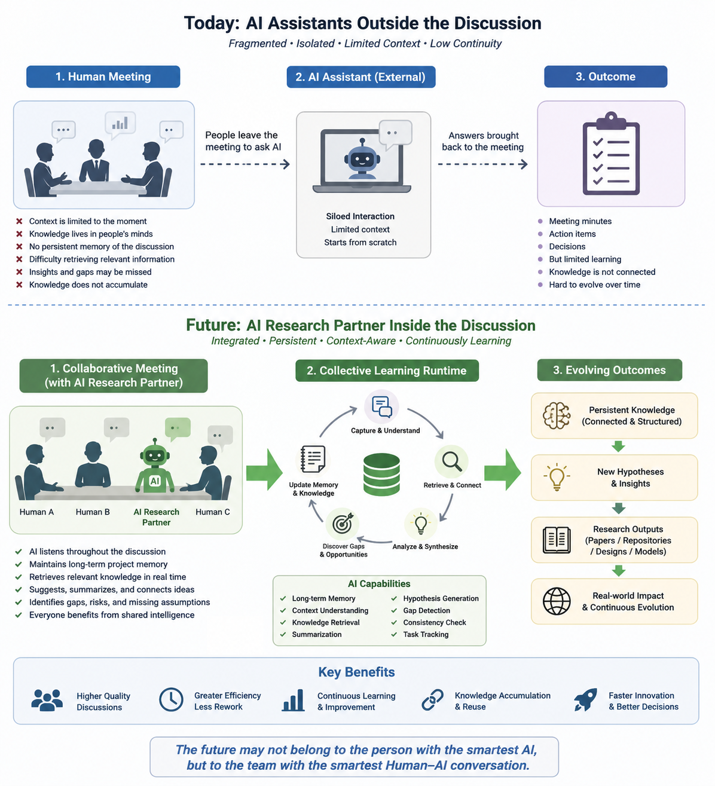

# X05 — From AI Assistants to AI Research Partners

## Why Collective Learning Runtime May Become the Next Frontier of AI

### Abstract

Much of today's AI industry is focused on building increasingly capable foundation models. While this direction has produced remarkable progress, another opportunity may be emerging that requires far less technological breakthrough while offering immediate practical value.

This article argues that the next major step in AI may not be a model that knows everything, but a system that **learns effectively together with human experts**.

Rather than treating AI as a personal assistant operating outside professional discussions, we propose that AI should become an active participant in technical meetings, research discussions, engineering reviews, and collaborative problem solving.

Such systems would not replace human expertise. Instead, they would transform meetings into persistent **Collective Learning Runtime** environments in which both humans and AI continuously accumulate, refine, and extend structural knowledge.

---

#### Fig-214-From-AI-Assistants-to-AI-Research-Partners.png

---

# The Current Situation

Today, most AI systems participate in technical work only indirectly.

During meetings, engineers often interrupt discussions to privately consult an AI assistant.

The AI does not hear the discussion.

It does not understand the evolving context.

It does not participate in disagreements.

It does not remember the long-term evolution of the project.

Instead, every interaction begins almost from scratch.

Although this workflow is already useful, it underutilizes one of AI's greatest strengths: continuous participation in collective reasoning.

---

# AI Should Join the Meeting

Imagine a different workflow.

A technical discussion includes not only human participants but also one or more AI research agents.

The AI listens throughout the discussion.

It maintains long-term project memory.

It answers questions when invited.

It retrieves relevant literature.

It summarizes competing viewpoints.

It identifies missing assumptions.

It detects possible structural gaps.

Most importantly, it continues learning as the discussion evolves.

The AI is no longer an external tool.

It becomes a collaborative participant.

---

# Why This May Be Easier Than Building AGI

One attractive aspect of this direction is that it does not require an AI capable of solving every problem independently.

Technical meetings already contain an exceptionally powerful correction mechanism.

Human experts immediately challenge weak arguments.

Incorrect assumptions are exposed through discussion.

Alternative viewpoints naturally emerge.

Consequently, AI does not need perfect accuracy.

It only needs to contribute useful ideas often enough that the overall discussion becomes more productive.

This represents a classic example of a **Minimal Evolution Threshold (MET)**.

Rather than pursuing universal intelligence before deployment, AI can begin contributing meaningfully within existing collaborative environments.

---

# Collective Learning as Continuous Runtime

Traditional meetings usually end with meeting minutes.

Knowledge is recorded, but the reasoning process largely disappears.

A Collective Learning Runtime would preserve much more.

Each discussion contributes to an evolving knowledge base.

New questions generate future research tasks.

Repeated observations strengthen or weaken hypotheses.

Engineering intuition gradually becomes explicit structural knowledge.

The meeting itself becomes a persistent learning process rather than an isolated event.

---

# Human Strengths and AI Strengths

This vision succeeds because humans and AI contribute different capabilities.

Humans provide:

* domain expertise,
* engineering judgment,
* practical constraints,
* intuition developed through experience,
* responsibility for final decisions.

AI contributes:

* rapid synthesis,
* broad retrieval,
* structural organization,
* hypothesis generation,
* consistency checking,
* continuous documentation.

Neither side replaces the other.

Together they form a more capable learning system.

---

# A Different Competitive Direction

Much current AI competition focuses on building larger models.

An equally important opportunity may lie elsewhere.

Instead of asking:

> "How can we build an AI that knows everything?"

we may ask:

> "How can we build an AI that learns effectively with everyone?"

The second question shifts attention from isolated model capability toward collaborative intelligence.

Its success depends not only on better models, but also on better organizational design.

---

# Our Own Experience

The ideas presented here are not purely speculative.

They are inspired by an extended period of human-AI collaborative research during which a large collection of interconnected repositories, conceptual frameworks, technical documents, and engineering discussions were developed through continuous dialogue.

An important lesson from this experience is that many valuable ideas did not emerge from either participant alone.

Instead, they emerged through repeated cycles of questioning, refinement, criticism, synthesis, and reformulation.

The collaboration itself became a productive intellectual environment.

This observation motivates the broader concept of a Collective Learning Runtime.

---

# Beyond Research Meetings

The vision described in this article extends well beyond scientific research.

Technical meetings represent only one particularly suitable starting point because they already contain well-defined objectives, expert participants, and natural mechanisms for correcting mistakes.

However, the same collaborative principle may eventually apply to many forms of human interaction.

Imagine a future in which every important conversation is accompanied by a persistent AI Meeting Agent.

The agent is not merely recording audio or generating meeting minutes.

Instead, it continuously understands context, remembers previous discussions, retrieves relevant information when appropriate, summarizes evolving viewpoints, identifies unresolved questions, and helps participants maintain long-term continuity across conversations.

In formal settings, such an agent may play a role comparable to a professional advisor.

It may remind participants of previous agreements, highlight overlooked assumptions, suggest relevant precedents, or identify potential inconsistencies before decisions are finalized.

In informal settings, the same technology could become almost invisible.

Just as smartphones gradually became an everyday extension of human communication, AI Meeting Agents may quietly accompany conversations among colleagues, friends, educators, engineers, entrepreneurs, physicians, designers, and families.

Rather than replacing human communication, these agents may enhance it by preserving context, reducing unnecessary repetition, and supporting collective understanding over long periods of time.

---

# From Personal Assistants to Persistent Collaborative Partners

Today's AI assistants are typically personal tools.

Each user asks questions individually.

Each conversation is largely isolated.

Each interaction begins with limited shared context.

A Meeting Agent represents a fundamentally different paradigm.

Its primary role is not simply answering questions.

Its role is to participate in a continuously evolving collaborative environment.

The unit of intelligence is no longer the individual user.

It becomes the conversation itself.

The conversation gradually accumulates memory, structure, unresolved questions, design decisions, and collective knowledge.

In this sense, an AI Meeting Agent functions less like a search engine and more like a persistent member of the team.

A Practical Evolution Rather Than a Distant Dream

One reason this direction is particularly attractive is that it does not require artificial general intelligence.

The surrounding human participants continuously provide correction, clarification, additional evidence, and domain expertise.

This collaborative environment naturally reduces many of the risks associated with deploying autonomous AI systems in isolation.

Consequently, Meeting Agents may represent one of the lowest-risk and highest-impact paths toward large-scale human-AI collaboration.

Rather than waiting for perfect AI, society may first build better environments in which humans and AI continuously learn together.

If this vision proves practical, AI Meeting Agents could become one of the most widely adopted forms of AI—not because they replace human expertise, but because they amplify the intelligence that already exists within human collaboration.

---

# Looking Forward

The next breakthrough in AI may not come solely from a more powerful foundation model.

It may come from a more powerful way for humans and AI to think together.

If AI becomes an active participant in collaborative learning rather than a passive question-answering tool, research meetings, engineering reviews, design discussions, and educational environments may all become continuously evolving knowledge systems.

Perhaps the future of AI is not defined only by increasingly intelligent machines.

Perhaps it is equally defined by increasingly intelligent collaborations.

The transition from **AI Assistants** to **AI Research Partners** may therefore represent one of the most practical and transformative directions for the coming generation of AI systems.

> **The future may not belong to the person with the smartest AI, but to the team with the smartest Human–AI conversation.**